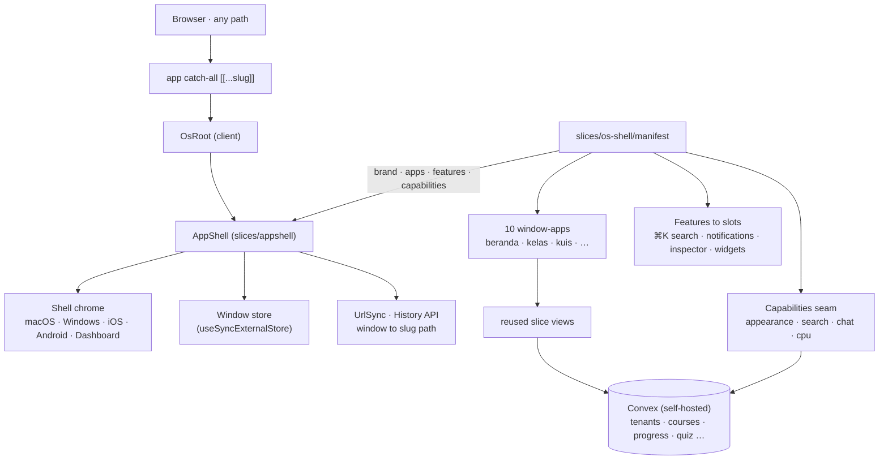

# Decision Log — belajar-with-rahmanef.com

> Hasil sesi 20 Q&A, 2026-07-05. Platform & komunitas belajar pengaplikasian AI.
> Prinsip: charity, budget seminim mungkin, pakai tools gratis yang sudah ada (Discord, YouTube).

## Keputusan

| # | Topik | Keputusan | Catatan |
|---|-------|-----------|---------|
| 1 | Target | **Campuran, multi-track** | Jalur belajar per audiens (umum, kerja, konten/UMKM). Tiap track bisa jadi komunitas/kelas terpisah — nyambung dengan multi-tenant. |
| 2 | Format | **Self-paced + live opsional** | Materi kapan saja; sesi live sesekali via Discord. |
| 3 | Bahasa | **Indonesia, istilah teknis tetap EN** | UI & materi ID; "prompt", "context", dsb. dibiarkan. |
| 4 | Multi-tenancy | **Full multi-tenant dari awal** | Siapa pun (yang di-approve) bisa buka komunitas sendiri. ⚠️ lihat konflik dengan #18. |
| 5 | Pembuatan tenant | **Request → approval admin** | Gate anti-spam; Rahman moderator tunggal. |
| 6 | Roles | **Owner + Instructor + Member** per tenant | Moderator/TA fase 2. |
| 7 | Struktur materi | **Kelas → Modul → Lesson** | Pola LMS standar. |
| 8 | Isi lesson | **YouTube embed + markdown + link resource** | Nol biaya storage. Tanpa upload file di v1. |
| 9 | Progress | **Tandai selesai per lesson** | Progress bar per modul & kelas. |
| 10 | Quiz | **MCQ auto-graded, opsional per modul** | Tanpa koreksi manual. |
| 11 | Sharing materi | **Member submit → kurasi instructor** | Papan "Resources" per komunitas. |
| 12 | Completion | **Badge di profil** (publik, bisa dibagikan) | Tanpa PDF. |
| 13 | Diskusi | **Discord-first** | Platform hanya menaut channel; tidak menyimpan chat. Komentar per lesson = fase 2. |
| 14 | Notifikasi | **In-app + Discord webhook** | Tanpa email di v1. |
| 15 | Auth | **Google OAuth saja** via @convex-dev/auth | Provider lain nanti jika ada demand. |
| 16 | Hosting | **Dokploy VPS + Convex self-hosted** | Sesuai stack pin rr. |
| 17 | URL tenant | **Path-based `/t/[slug]`** | Subdomain = fase 2. |
| 18 | Scope MVP | **Landing + 1 kelas dulu** | ⚠️ lihat konflik dengan #4. |
| 19 | Kelas pertama | **Semua track, ditambah bertahap** + **fitur usulan kelas** | Mulai dari satu kelas, track lain menyusul. User terdaftar bisa submit usulan kelas/topik (suggestion box). |
| 20 | Next step | **Spec/PRD dulu → build** | PRD + skema Convex + daftar vertical slice, review, baru koding. |

## Konflik #4 vs #18 — ✅ RESOLVED (2026-07-05, disetujui Rahman)

*Arsitektur* full multi-tenant dari hari 1 (semua tabel ber-`tenantId`, routing `/t/[slug]` jalan) — tapi *rilis* v1 hanya berisi landing page + tenant pertama (punya Rahman) + 1 kelas. Form "buka komunitas" + flow approval menyusul di v1.1. Nol refactor, launch tetap cepat.

Spec turunan: [docs/PRD.md](docs/PRD.md) · [docs/DATA-MODEL.md](docs/DATA-MODEL.md) · [docs/SLICES.md](docs/SLICES.md)

## Fitur baru dari Q&A (di luar rencana awal)

- **Suggestion box** (dari #19): user terdaftar bisa mengusulkan kelas/topik baru; masuk antrian untuk direview owner/instructor. Bisa satu slice dengan resource board (#11) — sama-sama pola submit→kurasi.

## Implikasi arsitektur (ringkas)

- Slices kandidat: `tenants` (profil komunitas + approval), `courses` (kelas/modul/lesson + YouTube embed), `progress` (completion + badge), `resources` (submit→kurasi, termasuk suggestion box), `quiz` (MCQ), `announcements` (in-app + Discord webhook), `profiles` (profil publik + badge).
- Semua tabel Convex ber-`tenantId` + index `by_tenant`; authz per-tenant (`requireTenantRole`) di setiap mutation (P0).
- Biaya berjalan v1: VPS (sudah ada) + domain. Sisanya Rp0.

## Urutan build v1 → v1.1

1. **v1 (launch):** auth Google → tenant pertama (seed) → kelas/modul/lesson → progress → landing.
2. **v1.1:** form buka komunitas + approval, resource board + suggestion box, quiz MCQ, badge + profil publik, pengumuman + Discord webhook.
3. **Fase 2:** komentar per lesson, moderator/TA, subdomain, email.

---

## Addendum — Pivot OS Desktop Shell (2026-07-07)

> Keputusan besar arsitektur **frontend**, disetujui owner (Rahman). Tabel 20 Q&A di atas **tetap sah** dan tidak diubah; addendum ini hanya menambah keputusan baru + menandai yang di-*supersede*.

### Keputusan

| # | Topik | Keputusan | Catatan |
|---|-------|-----------|---------|
| 21 | Kerangka UI | **OS desktop shell**, bukan halaman berbasis route | UI dibangun ulang dari `/t/[slug]` menjadi desktop OS berjendela di atas framework `slices/appshell` yang di-vendor (5 shell: macOS · Windows · iOS · Android · Dashboard; window manager, dock, launcher, ⌘K Spotlight, notifikasi, inspector, widgets). Layer integrasi = `slices/os-shell/` (manifest, capabilities, os-root, `apps/`). |
| 22 | Routing | **Satu catch-all `app/[[...slug]]/page.tsx`** untuk semua path | Desktop di-render untuk SETIAP path; URL disinkron via History API (`routing: true`). Route group lama `app/(public)`, `app/t/[slug]`, `app/u/[username]` **dihapus**. `app/admin` + `app/api` tetap. |
| 23 | Isi desktop | **10 window-app** yang me-*reuse* view slice lama | beranda · komunitas · kelas · kuis · profil · resources · pengumuman · kelola · pengaturan · masuk. Tiap app = wrapper client tipis di atas view + query Convex yang sudah ada (tanpa nulis ulang logika domain). |
| 24 | URL tenant/course | **Deep-link berbasis app**: `/komunitas/<tenant>`, `/kelas/<tenant>/<course>` | **SUPERSEDE #17** (`/t/[slug]`). Path lain: `/kelas/<tenant>/<course>/lesson/<id>`, `/kuis/<tenant>/<course>/<module>`, `/profil/<username>`, `/resources|pengumuman|kelola/<tenant>`, `/pengaturan`, `/masuk`. `openApp(id, title, [segs])` (di `apps/_nav.ts`) meng-encode param ke `payload.path`; UrlSync appshell mirror ke address bar, link yang di-paste re-open jendela yang sama. |
| 25 | Scope shell | **Full desktop OS** — trade-off SEO katalog publik | Dipilih owner secara sadar: pengalaman OS penuh > halaman katalog publik yang ter-index mesin pencari. Cold boot auto-open Beranda. |
| 26 | Capabilities seam | **`manifest.capabilities`, 4/7 wired** | appearance (next-themes) · cpu (stub null) · **search** (Convex course+community) · **chat** (placeholder "coming soon"). Diabaikan: systemStats, serverToggle (tak ada analogi belajar). Ini titik injeksi yang menyalakan fitur shell. |
| 27 | AI study-assistant | **Placeholder dulu, LLM asli DITUNDA** | `chatComingSoon` sekarang cuma placeholder. LLM nyata butuh `ANTHROPIC_API_KEY` di backend Convex self-hosted + `convex deploy` manual, lalu swap ke httpAction. Lihat juga [claude-api] saat mengimplementasi. |

### Yang TIDAK berubah

- **Backend Convex self-hosted UTUH**: schema, tabel, authz, dan `convex/features/<slice>` (tenants, courses, progress, profiles, resources, quiz, announcements) **sama persis**. [docs/DATA-MODEL.md](docs/DATA-MODEL.md) masih valid.
- **Keputusan #1–16, #18–20 tetap berlaku** apa adanya. Slice domain menyimpan fungsi Convex + view presentasional-nya; **hanya host frontend-nya yang pindah** (route → jendela OS).
- Konflik #4 vs #18 yang sudah RESOLVED (2026-07-05) tetap berlaku.

### Desain

Bespoke **"Editorial Warmth"** (Fraunces + Hanken, token oklch terracotta) tetap dipakai. Chrome shell mengikuti preset tweakcn aktif (warna, radius, font) via remap token di `app/globals.css` (glass/window/dock → `--card`/`--radius`).

### Diagram — arsitektur sistem (pasca-pivot)

### Status terkait

- **Rotasi secret** (STATUS #12, dipegang Rahman, URGENT) — belum berubah.
- **AI tutor asli** — blocked di owner set API key + deploy manual.
