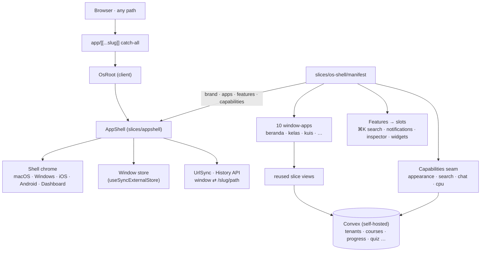

# belajar-with-rahmanef.com

Platform belajar pengaplikasian AI berbentuk **OS desktop di browser** — gratis, multi-tenant, self-hosted. Discord-first, YouTube-embed. Charity project by Rahman.

> Setiap path membuka satu desktop windowed (macOS · Windows · iOS · Android · Dashboard) yang membungkus slice-slice belajar sebagai app. Backend Convex tidak berubah — hanya chrome frontend-nya yang jadi OS.

**Agents: read [AGENTS.md](AGENTS.md) first** (binding contract), then claim your assignment in [docs/STATUS.md](docs/STATUS.md).
Docs: [DECISIONS](DECISIONS.md) · [PRD](docs/PRD.md) · [DATA-MODEL](docs/DATA-MODEL.md) · [SLICES](docs/SLICES.md) · [AGENT-PROMPTS](docs/AGENT-PROMPTS.md)

Scaffolded with [`rahman-resources`](https://www.npmjs.com/package/rahman-resources) — Next 16 + React 19 + Convex (self-hosted) + Tailwind 4 + shadcn/ui.

## Architecture



One catch-all route (`app/[[...slug]]/page.tsx`) renders the desktop for every path: it mounts `OsRoot`, which mounts `<AppShell>` from the vendored **`slices/appshell`** framework. The integration layer **`slices/os-shell/`** supplies a `manifest` that drives everything — brand, the **10 window-apps** (beranda · komunitas · kelas · kuis · profil · resources · pengumuman · kelola · pengaturan · masuk), shell features (⌘K search, notifications, lesson inspector, widgets), and the capabilities seam. Each window-app is a thin wrapper that **reuses the existing slice views + Convex queries** — no domain logic was rewritten, and the **Convex backend (schema, authz, `convex/features/<slice>`) is unchanged**. Deep-links like `/kelas/<tenant>/<course>/lesson/<id>` round-trip through the window store ⇄ History-API `UrlSync`, so any window is shareable.

## Bootstrap tenant pertama (sekali, setelah login Google pertama)

```bash
npx convex run seed:bootstrap '{"ownerEmail":"rahmanef63@gmail.com","username":"rahman","displayName":"Rahman","tenantSlug":"belajar-ai","tenantName":"Belajar AI bareng Rahman","tenantDescription":"Komunitas belajar pengaplikasian AI untuk semua orang."}'
```

## Setup

```bash
npm install --legacy-peer-deps
cp .env.example .env.local           # fill NEXT_PUBLIC_CONVEX_URL etc.
npx convex dev --once                 # generates convex/_generated
npm run dev
```

## Add a slice

Browse the live showcase — the [Grand Tour](https://resource.rahmanef.com/tour) —
where every slice is mounted live with its `add` command. Then:

```bash
npx rahman-resources list
npx rahman-resources info <slug>
npx rahman-resources add landing-sections .    # marketing sections (hero/pricing/faq/blog…)
npx rahman-resources add ai-chat .             # AI chat workbench
npx rahman-resources add appshell .            # windowed web-OS shell
```

> rr is a **slice picker**: each `add` copies files into `slices/<slug>/`, which
> you own and edit. The showcase at `/tour` is Convex-free (localStorage demo
> adapters); your app wires the slice into your own backend.
>
> This app's OS is built on two slices: **`slices/appshell`** (the vendored
> window-OS framework) and **`slices/os-shell`** (our integration layer —
> `manifest.tsx`, `capabilities.ts`, `os-root.tsx`, `apps/`) that wires appshell
> to our Convex-backed domain slices. See [Architecture](#architecture).

## Deploy

**Live (production) — Dokploy + self-hosted Convex.** A `git push origin main`
triggers the Dokploy webhook → build → deploy of the frontend; the backend runs
on **self-hosted Convex**. Convex does **not** auto-deploy on push — any change
under `convex/` needs a manual `npx convex deploy`. Live: https://study-with.rahmanef.com.

### Alternative — Vercel + Convex Cloud

`vercel.json` sets `buildCommand: npm run build:auto`, which adapts to your env:

| `CONVEX_DEPLOY_KEY` | What `build:auto` runs |
|---|---|
| **set** | `setup-auth` (one-time `@convex-dev/auth` keys) → `convex deploy --cmd 'next build'` — deploys functions to Convex Cloud, codegens `convex/_generated`, and injects `NEXT_PUBLIC_CONVEX_URL` into the build. |
| **unset** | plain `next build` — zero-config deploy of the scaffold as-is (no backend wired yet). |

So a fresh deploy is green either way: set `CONVEX_DEPLOY_KEY` in Vercel for the
full Cloud-backed app, or leave it unset to ship the static scaffold first.

> **Self-hosted (Docker/Dokploy):** commit `convex/_generated` so the container
> typecheck/build runs without codegen — see `.gitignore`. (Vercel + Convex Cloud
> needs no commit; `build:auto` codegens during deploy.)

## Hard rules

- **NO Clerk.** Auth = `@convex-dev/auth`.
- **shadcn primitives only** — no raw `<dialog>`, `<input type=date|file>`.
- Use `proxy.ts` (not `middleware.ts`) on Next 16.

## Stack

| | |
|---|---|
| Framework | Next.js 16 (App Router + cacheComponents, single catch-all route) |
| UI shell | `slices/appshell` (window-OS) + `slices/os-shell` (integration) |
| UI | React 19 + Tailwind 4 + shadcn |
| Design | bespoke "Editorial Warmth" (Fraunces + Hanken, terracotta oklch tokens) |
| Backend | Convex — **self-hosted** live (Cloud is the alt path) |
| Auth | `@convex-dev/auth` (Password provider by default) |
