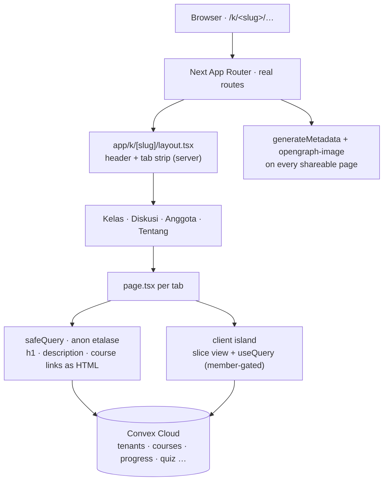

# belajar-with-rahmanef.com

A platform and community for learning applied AI, in Bahasa Indonesia — free, multi-tenant. YouTube-embed for video, Discord for realtime chat. Charity project by Rahman.

> A Skool.com-style tabbed community app on plain Next.js routes: Kelas · Diskusi · Anggota · Tentang. The windowed OS desktop that used to render every path was deleted on 2026-08-09 (see DECISIONS.md addendum); the Convex backend is unchanged.

**Agents: read [AGENTS.md](AGENTS.md) first** (binding contract), then claim your assignment in [docs/STATUS.md](docs/STATUS.md).
Docs: [DECISIONS](DECISIONS.md) · [PRD](docs/PRD.md) · [DATA-MODEL](docs/DATA-MODEL.md) · [SLICES](docs/SLICES.md) · [AGENT-PROMPTS](docs/AGENT-PROMPTS.md) · [ASSETS](docs/ASSETS.md)

Scaffolded with [`rahman-resources`](https://www.npmjs.com/package/rahman-resources) — Next 16 + React 19 + Convex Cloud + Tailwind 4 + shadcn/ui.

## Architecture


```mermaid
flowchart TD
  U["Browser · /k/&lt;slug&gt;/…"] --> RT["Next App Router · real routes"]
  RT --> LAY["app/k/[slug]/layout.tsx<br/>header + tab strip (server)"]
  LAY --> TABS["Kelas · Diskusi · Anggota · Tentang"]
  TABS --> PG["page.tsx per tab"]
  PG --> SRV["safeQuery · anon etalase<br/>h1 · description · course links as HTML"]
  PG --> CLI["client island<br/>slice view + useQuery (member-gated)"]
  RT --> META["generateMetadata + opengraph-image<br/>on every shareable page"]
  SRV --> CVX[("Convex Cloud<br/>tenants · courses · progress · quiz …")]
  CLI --> CVX
```

`/` redirects to the flagship community; `app/k/[slug]/layout.tsx` (~140 LOC) is the whole shell — a
server-rendered header plus a four-tab strip. Public surfaces (community, course, about, profile,
certificate) are **server-rendered** with real `generateMetadata` and per-page OG images, so a pasted
link unfurls properly and a crawler gets text. Membership-gated surfaces (lesson, quiz, Diskusi,
Kelola, search) stay client islands using the existing slice views + Convex hooks — **no domain logic
was rewritten** and the **Convex backend (schema, authz, `convex/features/<slice>`) is unchanged**.

Server components are permanently **anonymous** (`ConvexAuthProvider` keeps tokens in localStorage,
`proxy.ts` is a stub), so only whitelisted etalase queries go through `lib/convex-server.ts`
`safeQuery()` — which never throws, so a Convex outage degrades instead of 500-ing.

> **History:** from 2026-07-07 to 2026-08-09 this frontend was a windowed OS desktop
> (`slices/appshell` + `slices/os-shell`, 21,267 LOC of chrome on one catch-all route). It was
> deleted as overkill — sharing was structurally broken (the URL mirrored window *focus*, and
> `generateMetadata` appeared in zero files). See the DECISIONS.md addendum; `git log` has the code.

## Bootstrap the first tenant (once, after the first Google sign-in)

```bash
npx convex run seed:bootstrap '{"ownerEmail":"rahmanef63@gmail.com","username":"rahman","displayName":"Rahman","tenantSlug":"belajar-ai","tenantName":"Belajar AI bareng Rahman","tenantDescription":"Komunitas belajar pengaplikasian AI untuk semua orang."}'
```

## Setup

```bash
npm install --legacy-peer-deps
cp .env.example .env.local           # fill NEXT_PUBLIC_CONVEX_URL etc.
npx convex dev --once                 # generates convex/_generated
npm run dev
```

## Add a slice

Browse the live showcase — the [Grand Tour](https://resource.rahmanef.com/tour) —
where every slice is mounted live with its `add` command. Then:

```bash
npx rahman-resources list
npx rahman-resources info <slug>
npx rahman-resources add landing-sections .    # marketing sections (hero/pricing/faq/blog…)
npx rahman-resources add ai-chat .             # AI chat workbench
```

> rr is a **slice picker**: each `add` copies files into `slices/<slug>/`, which
> you own and edit. The showcase at `/tour` is Convex-free (localStorage demo
> adapters); your app wires the slice into your own backend.
>
> Do NOT re-add `appshell` here — it was deliberately removed (see Architecture).

## Deploy

**Live (production) — Dokploy + Convex Cloud (`rare-toucan-552`).** A `git push origin main`
triggers the Dokploy webhook → build → deploy of the frontend. Convex does **not** auto-deploy on
push — any change under `convex/` needs a manual `npx convex deploy --prod`, and it must land
BEFORE the frontend deploy. The Docker build now REQUIRES
`--build-arg NEXT_PUBLIC_CONVEX_URL=https://rare-toucan-552.convex.cloud`: the value is inlined at
build time with no runtime override, so a missing one used to silently ship a frontend pointed at the
retired self-hosted backend. Live: https://study-with.rahmanef.com.

### Alternative — Vercel + Convex Cloud

`vercel.json` sets `buildCommand: npm run build:auto`, which adapts to your env:

| `CONVEX_DEPLOY_KEY` | What `build:auto` runs |
|---|---|
| **set** | `setup-auth` (one-time `@convex-dev/auth` keys) → `convex deploy --cmd 'next build'` — deploys functions to Convex Cloud, codegens `convex/_generated`, and injects `NEXT_PUBLIC_CONVEX_URL` into the build. |
| **unset** | plain `next build` — zero-config deploy of the scaffold as-is (no backend wired yet). |

So a fresh deploy is green either way: set `CONVEX_DEPLOY_KEY` in Vercel for the
full Cloud-backed app, or leave it unset to ship the static scaffold first.

> **Self-hosted (Docker/Dokploy):** commit `convex/_generated` so the container
> typecheck/build runs without codegen — see `.gitignore`. (Vercel + Convex Cloud
> needs no commit; `build:auto` codegens during deploy.)

## Brand assets

The in-app mark is **code, not a file**: `components/brand/logo.tsx` (`Logo` / `LogoMark`) is a
procedural SVG drawn with `currentColor` — ~1 KB, crisp from 16 px to 512 px, re-tints with the
theme. `app/icon.svg` is the favicon of record. **Never import a brand PNG into a component.**

The PNGs below are for **outside** the app — README, GitHub, Discord, decks, press. They are baked
raster on a `#071536` field (not `--background` `#090f1c`), so they show a visible box if dropped on
a page surface, and they cannot follow the theme.


| File | Dim | Use |
|---|---|---|
| `public/brand/wordmark-horizontal.png` | 1200×400 | Default lockup — README headers, slides, sponsor listings |
| `public/brand/wordmark-stacked.png` | 800×1200 | Portrait lockup — stories, posters |

Social artwork (`public/social/*`) is uploaded into other products' settings, not served by the site
— the GitHub social preview is a **repo setting**, the Discord banner is a **Discord server
setting**. Which files are actually wired, which are not, and why, is the table in
**[docs/ASSETS.md](docs/ASSETS.md)** — including the measured reason the root OG card stays
generated (`app/opengraph-image.tsx` + `lib/og.tsx`) instead of serving the static `og-default.png`.

## Hard rules

- **NO Clerk.** Auth = `@convex-dev/auth`.
- **shadcn primitives only** — no raw `<dialog>`, `<input type=date|file>`.
- Use `proxy.ts` (not `middleware.ts`) on Next 16.

## Stack

| | |
|---|---|
| Framework | Next.js 16 (App Router, real routes; cacheComponents OFF) |
| UI shell | `app/k/[slug]/layout.tsx` (~140 LOC: header + tab strip) |
| UI | React 19 + Tailwind 4 + shadcn |
| Design | ONE dark theme, gold accent, 1px borders, `--radius: 0.375rem`, ordinary depth shadows; Sora as the DISPLAY-only face. Tokens live in `app/globals.css` (SSOT) and are written up in [docs/design/BRAND.md](docs/design/BRAND.md). Two earlier directions — "Editorial Warmth" and "Arcade Cabinet" — are retired; don't revive either without a new decision. |
| Backend | Convex **Cloud** `rare-toucan-552` (self-hosted retired 2026-07-10) |
| Auth | `@convex-dev/auth` — **Google OAuth only** (no password option; see DECISIONS #15) |

## Related projects

Part of the Rahman web-OS family:

- **[Rahman OS](https://shell.rahmanef.com)** — manifest-driven desktop/mobile web-OS shell. ([`shell-rahmanef-com`](https://github.com/rahmanef63/shell-rahmanef-com))
- **[Topside](https://os.rahmanef.com)** — mobile-first web cockpit for a headless Linux VPS. ([`os-vps`](https://github.com/rahmanef63/os-vps))
- **[Rahman Resources](https://resource.rahmanef.com)** — the slice & component library these UIs are built from. ([`resource-site`](https://github.com/rahmanef63/resource-site))
