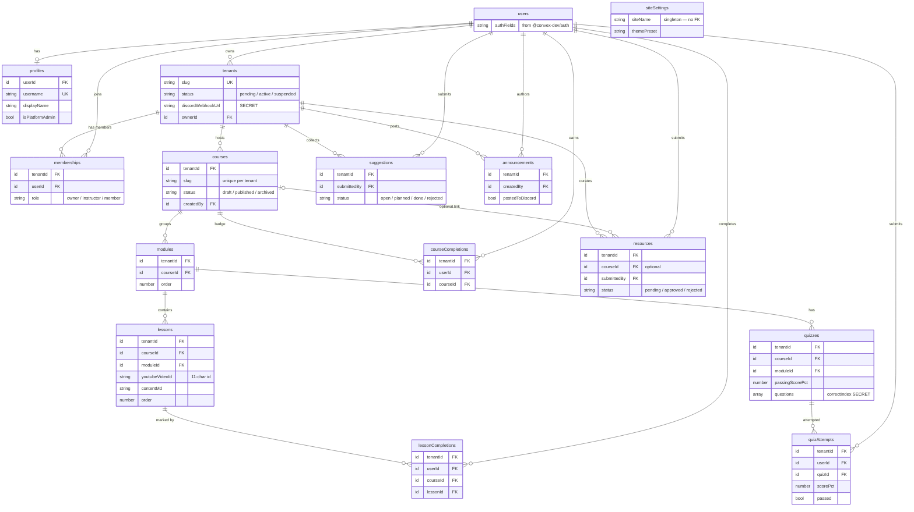

# Data Model — Convex

> Menyertai [PRD.md](PRD.md). Full multi-tenant dari hari 1: semua tabel domain ber-`tenantId`.
> `_creationTime` bawaan Convex dipakai sebagai timestamp — tidak ada field `createdAt` manual.

> **Catatan (pivot OS-shell, 2026-07):** Skema & backend Convex **tidak berubah** oleh pivot
> frontend ke OS desktop shell. Tabel, index, authz, dan fungsi `convex/features/<slice>` tetap
> identik; yang berpindah hanya *host* frontend-nya — dari route Next.js (`app/(public)`,
> `app/t/[slug]`, `app/u/[username]`) menjadi window-app OS yang meng-konsumsi query/mutation
> yang sama persis. Doc ini masih 100% valid. Lihat [UI-UX-PRD.md](UI-UX-PRD.md) untuk cara
> tiap app membungkus view slice yang sudah ada.

## Diagram relasi (ERD)

Cerminan langsung `convex/schema.ts` (tabel + relasi kunci; field rahasia ditandai). `users`
berasal dari `@convex-dev/auth`. `siteSettings` singleton config tidak punya relasi.



> Catatan hierarki: `lessons` & `quizzes` juga membawa `courseId` (denormalisasi untuk query
> `by_course`), selain `moduleId` yang dipetakan di diagram. `siteSettings` adalah singleton
> branding bawaan starter (satu baris, tanpa `tenantId`) — bukan tabel domain.

## Skema target (convex/schema.ts)

```ts
import { defineSchema, defineTable } from "convex/server";
import { v } from "convex/values";
import { authTables } from "@convex-dev/auth/server";

export default defineSchema({
  ...authTables, // users, sessions, dst. dari @convex-dev/auth

  // Singleton config branding bawaan rr starter (satu baris, tanpa tenantId).
  siteSettings: defineTable({
    siteName: v.optional(v.string()),
    tagline: v.optional(v.string()),
    ownerName: v.optional(v.string()),
    contactEmail: v.optional(v.string()),
    brandColor: v.optional(v.string()),
    themeDefault: v.optional(v.string()),
    themePreset: v.optional(v.string()),
    logoUrl: v.optional(v.string()),
    faviconUrl: v.optional(v.string()),
    socials: v.optional(v.string()),
    seoDescription: v.optional(v.string()),
    analyticsId: v.optional(v.string()),
    onboardedAt: v.optional(v.number()),
  }),

  profiles: defineTable({
    userId: v.id("users"),
    username: v.string(),            // unik global, deep-link /profil/<username>
    displayName: v.string(),
    bio: v.optional(v.string()),
    avatarUrl: v.optional(v.string()),
    isPlatformAdmin: v.optional(v.boolean()),
  })
    .index("by_user", ["userId"])
    .index("by_username", ["username"]),

  tenants: defineTable({
    slug: v.string(),                // unik global, deep-link /komunitas/<tenant>
    name: v.string(),
    description: v.string(),
    track: v.optional(v.string()),   // "umum" | "kerja" | "konten" | lainnya
    discordInviteUrl: v.optional(v.string()),
    discordWebhookUrl: v.optional(v.string()), // RAHASIA — lihat Keamanan #1
    status: v.union(v.literal("pending"), v.literal("active"), v.literal("suspended")),
    requestMessage: v.optional(v.string()),    // pesan pengajuan (R7)
    ownerId: v.id("users"),
  })
    .index("by_slug", ["slug"])
    .index("by_status", ["status"]),

  memberships: defineTable({
    tenantId: v.id("tenants"),
    userId: v.id("users"),
    role: v.union(v.literal("owner"), v.literal("instructor"), v.literal("member")),
  })
    .index("by_tenant", ["tenantId"])
    .index("by_user", ["userId"])
    .index("by_tenant_user", ["tenantId", "userId"]),

  courses: defineTable({
    tenantId: v.id("tenants"),
    slug: v.string(),                // unik per tenant
    title: v.string(),
    description: v.string(),
    coverImageUrl: v.optional(v.string()),
    status: v.union(v.literal("draft"), v.literal("published"), v.literal("archived")),
    createdBy: v.id("users"),
  })
    .index("by_tenant", ["tenantId"])
    .index("by_tenant_slug", ["tenantId", "slug"])
    .index("by_tenant_status", ["tenantId", "status"]),

  modules: defineTable({
    tenantId: v.id("tenants"),
    courseId: v.id("courses"),
    title: v.string(),
    order: v.number(),
  }).index("by_course", ["courseId"]),

  lessons: defineTable({
    tenantId: v.id("tenants"),
    courseId: v.id("courses"),
    moduleId: v.id("modules"),
    title: v.string(),
    youtubeVideoId: v.optional(v.string()), // hanya ID, bukan URL penuh
    contentMd: v.string(),
    links: v.array(v.object({ label: v.string(), url: v.string() })),
    order: v.number(),
  })
    .index("by_module", ["moduleId"])
    .index("by_course", ["courseId"]),

  lessonCompletions: defineTable({
    tenantId: v.id("tenants"),
    userId: v.id("users"),
    courseId: v.id("courses"),
    lessonId: v.id("lessons"),
  })
    .index("by_user_lesson", ["userId", "lessonId"])
    .index("by_user_course", ["userId", "courseId"])
    .index("by_course", ["courseId"]),

  courseCompletions: defineTable({   // = badge (R11)
    tenantId: v.id("tenants"),
    userId: v.id("users"),
    courseId: v.id("courses"),
  })
    .index("by_user", ["userId"])
    .index("by_user_course", ["userId", "courseId"]),

  quizzes: defineTable({
    tenantId: v.id("tenants"),
    courseId: v.id("courses"),
    moduleId: v.id("modules"),
    title: v.string(),
    passingScorePct: v.number(),
    questions: v.array(v.object({
      prompt: v.string(),
      options: v.array(v.string()),
      correctIndex: v.number(),      // RAHASIA — lihat Keamanan #2
      explanation: v.optional(v.string()),
    })),
  }).index("by_module", ["moduleId"]),

  quizAttempts: defineTable({
    tenantId: v.id("tenants"),
    userId: v.id("users"),
    quizId: v.id("quizzes"),
    answers: v.array(v.number()),
    scorePct: v.number(),
    passed: v.boolean(),
  })
    .index("by_user_quiz", ["userId", "quizId"])
    .index("by_quiz", ["quizId"]),

  resources: defineTable({
    tenantId: v.id("tenants"),
    title: v.string(),
    url: v.string(),
    note: v.optional(v.string()),
    courseId: v.optional(v.id("courses")), // opsional: resource terkait kelas tertentu
    submittedBy: v.id("users"),
    status: v.union(v.literal("pending"), v.literal("approved"), v.literal("rejected")),
    reviewedBy: v.optional(v.id("users")),
  })
    .index("by_tenant_status", ["tenantId", "status"])
    .index("by_submitter", ["submittedBy"]),

  suggestions: defineTable({         // usulan kelas/topik (R9)
    tenantId: v.id("tenants"),
    title: v.string(),
    detail: v.optional(v.string()),
    submittedBy: v.id("users"),
    status: v.union(v.literal("open"), v.literal("planned"), v.literal("done"), v.literal("rejected")),
  }).index("by_tenant_status", ["tenantId", "status"]),

  comments: defineTable({
    // fase-2 (#16): diskusi per lesson, reply 1-level (root -> replies).
    tenantId: v.id("tenants"),
    lessonId: v.id("lessons"),
    userId: v.id("users"),
    bodyMd: v.string(),
    parentId: v.optional(v.id("comments")),
    deletedAt: v.optional(v.number()),
  })
    .index("by_lesson", ["lessonId"])
    .index("by_parent", ["parentId"])
    .index("by_user", ["userId"]),

  suggestionVotes: defineTable({
    // fase-2 (#18): satu vote per user per usulan; count DIHITUNG, tidak disimpan.
    tenantId: v.id("tenants"),
    suggestionId: v.id("suggestions"),
    userId: v.id("users"),
  })
    .index("by_suggestion", ["suggestionId"])
    .index("by_suggestion_user", ["suggestionId", "userId"])
    .index("by_user", ["userId"]),

  announcements: defineTable({
    tenantId: v.id("tenants"),
    title: v.string(),
    bodyMd: v.string(),
    createdBy: v.id("users"),
    postedToDiscord: v.boolean(),
  }).index("by_tenant", ["tenantId"]),
});
```

13 tabel domain (+ `siteSettings` singleton config bawaan starter, di luar hitungan domain). v1 memakai: profiles, tenants, memberships, courses, modules, lessons, lessonCompletions, courseCompletions. Sisanya v1.1 — tetap dideklarasikan sejak awal agar tidak ada migrasi.

## Authz & helper (convex/_shared/auth.ts)

- `requireUser(ctx)` → userId, atau throw `NOT_AUTHENTICATED`.
- `requireTenantRole(ctx, tenantId, min)` → membership; hierarki `member < instructor < owner`; cek via index `by_tenant_user`.
- `requirePlatformAdmin(ctx)` → cek `profiles.isPlatformAdmin`.

Kontrak P0 untuk **setiap** query/mutation publik: (1) `args` dengan validator `v.*` lengkap; (2) helper authz di baris pertama handler. Route-layer guard hanya UX, bukan keamanan.

## Aturan akses per tabel

| Tabel | Baca | Tulis |
|---|---|---|
| tenants | publik (field aman saja — tanpa `discordWebhookUrl`) | owner (profil), platform admin (status) |
| memberships | member tenant ybs. | join: user sendiri; ubah role: owner (R13) |
| courses/modules/lessons | published: member; draft: instructor+ ; judul/deskripsi kelas: publik (etalase) | instructor+ |
| lessonCompletions | user sendiri; agregat: instructor+ | user sendiri (mark complete) |
| courseCompletions | publik via profil (badge) | sistem — otomatis dari mutation progress |
| quizzes | member, **tanpa** `correctIndex`/`explanation` | instructor+ |
| quizAttempts | user sendiri | user sendiri; penilaian server-side |
| resources/suggestions | approved/open: member; pending: instructor+ & pengusul | submit: member; kurasi: instructor+ |
| announcements | member tenant | instructor+ |
| comments (fase-2 #16) | member tenant (lesson yang bisa ia akses); deleted → placeholder | tulis: member; soft-delete: author atau instructor+ |
| suggestionVotes (fase-2 #18) | count agregat: member tenant | toggle: user sendiri (unik via by_suggestion_user) |

## Catatan keamanan (P0)

1. **`discordWebhookUrl` tidak pernah keluar lewat query.** Query publik tenant memakai projection field aman. Posting ke Discord lewat internal action `postToDiscord` yang membaca webhook di server.
2. **Kunci jawaban quiz tidak pernah terkirim ke client.** Query pengerjaan mengembalikan soal tanpa `correctIndex`/`explanation`; penilaian di mutation `submitAttempt`; explanation dikembalikan hanya pada hasil attempt.
3. **Tidak ada bare `.collect()`.** Semua query via `.withIndex(...)` + `.take(n)` / pagination. Batas by-design: lessons per course ≤ 200, modules per course ≤ 30.
4. **Anti-spam ringan (R8/R9):** submit ditolak `RATE_LIMITED` jika user punya >5 item pending di tenant tsb. (cek bounded via index).
5. **Error:** selalu `ConvexError({ code, message })`. Kode di `types.ts` per slice: `NOT_AUTHENTICATED | NOT_AUTHORIZED | NOT_FOUND | VALIDATION_FAILED | RATE_LIMITED`. Tidak ada detail internal di message.

## Derivasi & invarian

- **Progress kelas** = count(`lessonCompletions` by_user_course) / count(`lessons` by_course) — dihitung, tidak disimpan.
- **courseCompletion** dibuat idempoten oleh `markLessonComplete` saat hitungan penuh (cek `by_user_course` dulu).
- **Slug unik:** `tenants.slug` global (`by_slug`); `courses.slug` per tenant (`by_tenant_slug`) — cek sebelum insert, tolak `VALIDATION_FAILED`.
- **Hapus lesson/module** hanya boleh jika belum ada completion terkait; jika sudah ada → arsipkan course, jangan hapus. Menjaga progress member tidak korup.
- **`youtubeVideoId`** divalidasi format ID (11 char) di mutation — bukan URL penuh, mencegah embed sembarang domain.
\n\n> **Fase-2 additions (2026-07-07, wave v1.2):** `comments` (reply 1-level; depth dijaga di mutation — parentId harus root; soft delete `deletedAt`, body diganti placeholder di query) dan `suggestionVotes` (idempotent toggle; jumlah vote = count via `by_suggestion`, tak pernah disimpan). Keduanya mengikuti seluruh P0 (validators, authz-first, auth-before-read, bounded reads).\n

> **Fase-2 additions (2026-07-11, wave v1.3):** `notifications` (inbox per user: kind comment_reply|resource_reviewed|suggestion_status, readAt nullable; index by_user, by_user_read; producer = internal mutation dijadwalkan dari feature sumber — pola zeta/discord) dan **search indexes**: `lessons.search_content` (searchField contentMd, filter tenantId) + `courses.search_title` (filter tenantId, status). Query pencarian WAJIB draft-guard (hanya published untuk member) & bounded take.
