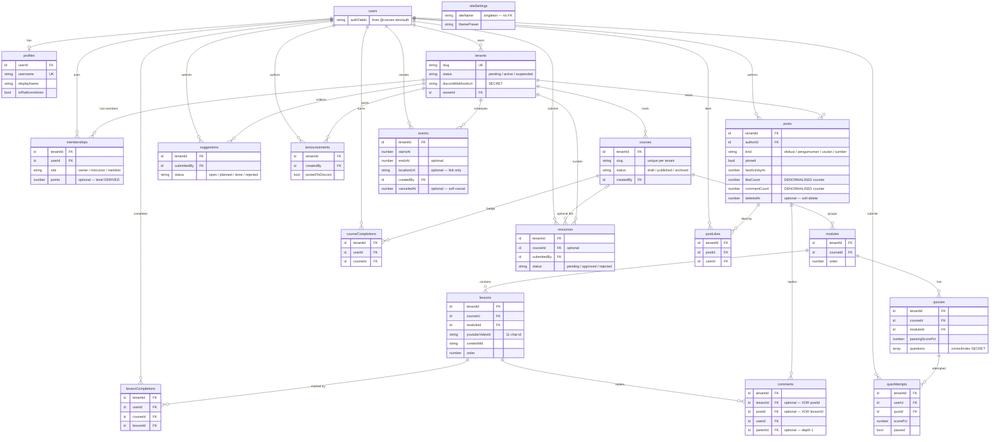

# Data Model — Convex

> Menyertai [PRD.md](PRD.md). Full multi-tenant dari hari 1: semua tabel domain ber-`tenantId`.
> `_creationTime` bawaan Convex dipakai sebagai timestamp — tidak ada field `createdAt` manual.

> **Catatan (pivot OS-shell, 2026-07):** Skema & backend Convex **tidak berubah** oleh pivot
> frontend ke OS desktop shell. Tabel, index, authz, dan fungsi `convex/features/<slice>` tetap
> identik; yang berpindah hanya *host* frontend-nya — dari route Next.js (`app/(public)`,
> `app/t/[slug]`, `app/u/[username]`) menjadi window-app OS yang meng-konsumsi query/mutation
> yang sama persis. Doc ini masih 100% valid. Lihat [UI-UX-PRD.md](UI-UX-PRD.md) untuk cara
> tiap app membungkus view slice yang sudah ada.

## Diagram relasi (ERD)

Cerminan langsung `convex/schema.ts` (tabel + relasi kunci; field rahasia ditandai). `users`
berasal dari `@convex-dev/auth`. `siteSettings` singleton config tidak punya relasi.


```mermaid
erDiagram
  users ||--o| profiles : "has"
  users ||--o{ tenants : "owns"
  tenants ||--o{ memberships : "has members"
  users ||--o{ memberships : "joins"
  tenants ||--o{ courses : "hosts"
  courses ||--o{ modules : "groups"
  modules ||--o{ lessons : "contains"
  modules ||--o{ quizzes : "has"
  lessons ||--o{ lessonCompletions : "marked by"
  users ||--o{ lessonCompletions : "completes"
  courses ||--o{ courseCompletions : "badge"
  users ||--o{ courseCompletions : "earns"
  quizzes ||--o{ quizAttempts : "attempted"
  users ||--o{ quizAttempts : "submits"
  tenants ||--o{ resources : "curates"
  courses |o--o{ resources : "optional link"
  users ||--o{ resources : "submits"
  tenants ||--o{ suggestions : "collects"
  users ||--o{ suggestions : "submits"
  tenants ||--o{ announcements : "posts"
  users ||--o{ announcements : "authors"
  tenants ||--o{ posts : "feeds"
  users ||--o{ posts : "authors"
  posts ||--o{ postLikes : "liked by"
  users ||--o{ postLikes : "likes"
  posts ||--o{ comments : "replies"
  lessons ||--o{ comments : "replies"
  tenants ||--o{ events : "schedules"
  users ||--o{ events : "creates"

  users {
    string authFields "from @convex-dev/auth"
  }
  profiles {
    id userId FK
    string username UK
    string displayName
    bool isPlatformAdmin
  }
  tenants {
    string slug UK
    string status "pending / active / suspended"
    string discordWebhookUrl "SECRET"
    id ownerId FK
  }
  memberships {
    id tenantId FK
    id userId FK
    string role "owner / instructor / member"
    number points "optional — level DERIVED"
  }
  posts {
    id tenantId FK
    id authorId FK
    string kind "diskusi / pengumuman / usulan / sumber"
    bool pinned
    number lastActivityAt
    number likeCount "DENORMALISED counter"
    number commentCount "DENORMALISED counter"
    number deletedAt "optional — soft delete"
  }
  postLikes {
    id tenantId FK
    id postId FK
    id userId FK
  }
  comments {
    id tenantId FK
    id lessonId FK "optional — XOR postId"
    id postId FK "optional — XOR lessonId"
    id userId FK
    id parentId FK "optional — depth 1"
  }
  events {
    id tenantId FK
    number startsAt
    number endsAt "optional"
    string locationUrl "optional — link only"
    id createdBy FK
    number canceledAt "optional — soft cancel"
  }
  courses {
    id tenantId FK
    string slug "unique per tenant"
    string status "draft / published / archived"
    id createdBy FK
  }
  modules {
    id tenantId FK
    id courseId FK
    number order
  }
  lessons {
    id tenantId FK
    id courseId FK
    id moduleId FK
    string youtubeVideoId "11-char id"
    string contentMd
    number order
  }
  lessonCompletions {
    id tenantId FK
    id userId FK
    id courseId FK
    id lessonId FK
  }
  courseCompletions {
    id tenantId FK
    id userId FK
    id courseId FK
  }
  quizzes {
    id tenantId FK
    id courseId FK
    id moduleId FK
    number passingScorePct
    array questions "correctIndex SECRET"
  }
  quizAttempts {
    id tenantId FK
    id userId FK
    id quizId FK
    number scorePct
    bool passed
  }
  resources {
    id tenantId FK
    id courseId FK "optional"
    id submittedBy FK
    string status "pending / approved / rejected"
  }
  suggestions {
    id tenantId FK
    id submittedBy FK
    string status "open / planned / done / rejected"
  }
  announcements {
    id tenantId FK
    id createdBy FK
    bool postedToDiscord
  }
  siteSettings {
    string siteName "singleton — no FK"
    string themePreset
  }
```

> Catatan hierarki: `lessons` & `quizzes` juga membawa `courseId` (denormalisasi untuk query
> `by_course`), selain `moduleId` yang dipetakan di diagram. `siteSettings` adalah singleton
> branding bawaan starter (satu baris, tanpa `tenantId`) — bukan tabel domain.

## Skema target (convex/schema.ts)

```ts
import { defineSchema, defineTable } from "convex/server";
import { v } from "convex/values";
import { authTables } from "@convex-dev/auth/server";

export default defineSchema({
  ...authTables, // users, sessions, dst. dari @convex-dev/auth

  // Singleton config branding bawaan rr starter (satu baris, tanpa tenantId).
  siteSettings: defineTable({
    siteName: v.optional(v.string()),
    tagline: v.optional(v.string()),
    ownerName: v.optional(v.string()),
    contactEmail: v.optional(v.string()),
    brandColor: v.optional(v.string()),
    themeDefault: v.optional(v.string()),
    themePreset: v.optional(v.string()),
    logoUrl: v.optional(v.string()),
    faviconUrl: v.optional(v.string()),
    socials: v.optional(v.string()),
    seoDescription: v.optional(v.string()),
    analyticsId: v.optional(v.string()),
    onboardedAt: v.optional(v.number()),
  }),

  profiles: defineTable({
    userId: v.id("users"),
    username: v.string(),            // unik global, deep-link /profil/<username>
    displayName: v.string(),
    bio: v.optional(v.string()),
    avatarUrl: v.optional(v.string()),
    isPlatformAdmin: v.optional(v.boolean()),
  })
    .index("by_user", ["userId"])
    .index("by_username", ["username"]),

  tenants: defineTable({
    slug: v.string(),                // unik global, deep-link /komunitas/<tenant>
    name: v.string(),
    description: v.string(),
    track: v.optional(v.string()),   // "umum" | "kerja" | "konten" | lainnya
    discordInviteUrl: v.optional(v.string()),
    discordWebhookUrl: v.optional(v.string()), // RAHASIA — lihat Keamanan #1
    status: v.union(v.literal("pending"), v.literal("active"), v.literal("suspended")),
    requestMessage: v.optional(v.string()),    // pesan pengajuan (R7)
    ownerId: v.id("users"),
  })
    .index("by_slug", ["slug"])
    .index("by_status", ["status"]),

  memberships: defineTable({
    tenantId: v.id("tenants"),
    userId: v.id("users"),
    role: v.union(v.literal("owner"), v.literal("instructor"), v.literal("member")),
    points: v.optional(v.number()),  // v1.8 (#30) — LEVEL DIDERIVASI, tak pernah disimpan
  })
    .index("by_tenant", ["tenantId"])
    .index("by_user", ["userId"])
    .index("by_tenant_user", ["tenantId", "userId"])
    .index("by_tenant_points", ["tenantId", "points"]), // papan peringkat

  courses: defineTable({
    tenantId: v.id("tenants"),
    slug: v.string(),                // unik per tenant
    title: v.string(),
    description: v.string(),
    coverImageUrl: v.optional(v.string()),
    status: v.union(v.literal("draft"), v.literal("published"), v.literal("archived")),
    createdBy: v.id("users"),
  })
    .index("by_tenant", ["tenantId"])
    .index("by_tenant_slug", ["tenantId", "slug"])
    .index("by_tenant_status", ["tenantId", "status"]),

  modules: defineTable({
    tenantId: v.id("tenants"),
    courseId: v.id("courses"),
    title: v.string(),
    order: v.number(),
  }).index("by_course", ["courseId"]),

  lessons: defineTable({
    tenantId: v.id("tenants"),
    courseId: v.id("courses"),
    moduleId: v.id("modules"),
    title: v.string(),
    youtubeVideoId: v.optional(v.string()), // hanya ID, bukan URL penuh
    contentMd: v.string(),
    links: v.array(v.object({ label: v.string(), url: v.string() })),
    order: v.number(),
  })
    .index("by_module", ["moduleId"])
    .index("by_course", ["courseId"]),

  lessonCompletions: defineTable({
    tenantId: v.id("tenants"),
    userId: v.id("users"),
    courseId: v.id("courses"),
    lessonId: v.id("lessons"),
  })
    .index("by_user_lesson", ["userId", "lessonId"])
    .index("by_user_course", ["userId", "courseId"])
    .index("by_course", ["courseId"]),

  courseCompletions: defineTable({   // = badge (R11)
    tenantId: v.id("tenants"),
    userId: v.id("users"),
    courseId: v.id("courses"),
  })
    .index("by_user", ["userId"])
    .index("by_user_course", ["userId", "courseId"]),

  quizzes: defineTable({
    tenantId: v.id("tenants"),
    courseId: v.id("courses"),
    moduleId: v.id("modules"),
    title: v.string(),
    passingScorePct: v.number(),
    questions: v.array(v.object({
      prompt: v.string(),
      options: v.array(v.string()),
      correctIndex: v.number(),      // RAHASIA — lihat Keamanan #2
      explanation: v.optional(v.string()),
    })),
  }).index("by_module", ["moduleId"]),

  quizAttempts: defineTable({
    tenantId: v.id("tenants"),
    userId: v.id("users"),
    quizId: v.id("quizzes"),
    answers: v.array(v.number()),
    scorePct: v.number(),
    passed: v.boolean(),
  })
    .index("by_user_quiz", ["userId", "quizId"])
    .index("by_quiz", ["quizId"]),

  resources: defineTable({
    tenantId: v.id("tenants"),
    title: v.string(),
    url: v.string(),
    note: v.optional(v.string()),
    courseId: v.optional(v.id("courses")), // opsional: resource terkait kelas tertentu
    submittedBy: v.id("users"),
    status: v.union(v.literal("pending"), v.literal("approved"), v.literal("rejected")),
    reviewedBy: v.optional(v.id("users")),
  })
    .index("by_tenant_status", ["tenantId", "status"])
    .index("by_submitter", ["submittedBy"]),

  suggestions: defineTable({         // usulan kelas/topik (R9)
    tenantId: v.id("tenants"),
    title: v.string(),
    detail: v.optional(v.string()),
    submittedBy: v.id("users"),
    status: v.union(v.literal("open"), v.literal("planned"), v.literal("done"), v.literal("rejected")),
  }).index("by_tenant_status", ["tenantId", "status"]),

  comments: defineTable({
    // fase-2 (#16): reply 1-level (root -> replies).
    // v1.8 (#29): target ganda — lessonId ATAU postId, tepat satu yang terisi
    // (dijaga di mutation). Dual optional FK dipilih di atas polymorphic
    // targetKind+targetId:v.string() supaya type-safety Id<> tetap utuh.
    // Baris komentar lesson lama TETAP VALID — tanpa migrasi data.
    tenantId: v.id("tenants"),
    lessonId: v.optional(v.id("lessons")),
    postId: v.optional(v.id("posts")),
    userId: v.id("users"),
    bodyMd: v.string(),
    parentId: v.optional(v.id("comments")),
    deletedAt: v.optional(v.number()),
  })
    .index("by_lesson", ["lessonId"])
    .index("by_post", ["postId"])
    .index("by_parent", ["parentId"])
    .index("by_user", ["userId"])
    .index("by_lesson_user", ["lessonId", "userId"])   // anti-spam per user per lesson
    .index("by_post_user", ["postId", "userId"]),      // anti-spam per user per post

  posts: defineTable({               // v1.8 (#29/#33) — feed Diskusi
    tenantId: v.id("tenants"),
    authorId: v.id("users"),
    kind: v.union(
      v.literal("diskusi"),
      v.literal("pengumuman"),       // instructor+ saja, dijaga di mutation
      v.literal("usulan"),
      v.literal("sumber"),
    ),
    title: v.string(),
    bodyMd: v.string(),
    linkUrl: v.optional(v.string()),        // post "sumber": tautan eksternal terkurasi
    youtubeVideoId: v.optional(v.string()), // 11 char, bukan URL penuh (mengikuti lessons)
    pinned: v.boolean(),
    lastActivityAt: v.number(),      // di-bump saat ada komentar/like; feed diurutkan di sini
    likeCount: v.number(),           // COUNTER TERSIMPAN — lihat Derivasi & invarian
    commentCount: v.number(),        // COUNTER TERSIMPAN
    deletedAt: v.optional(v.number()),
  })
    .index("by_tenant_pinned_activity", ["tenantId", "pinned", "lastActivityAt"])
    .index("by_tenant_kind", ["tenantId", "kind"])
    .index("by_author", ["authorId"])
    .searchIndex("search_title", { searchField: "title", filterFields: ["tenantId"] }),

  postLikes: defineTable({           // v1.8 (#30) — generalisasi suggestionVotes
    tenantId: v.id("tenants"),
    userId: v.id("users"),
    postId: v.id("posts"),
  })
    .index("by_post", ["postId"])
    .index("by_post_user", ["postId", "userId"])
    .index("by_user", ["userId"]),

  events: defineTable({              // v1.8 (#31) — Kalender, BARIS DISKRIT SAJA
    tenantId: v.id("tenants"),
    title: v.string(),
    description: v.optional(v.string()),
    startsAt: v.number(),            // epoch ms UTC
    endsAt: v.optional(v.number()),
    locationUrl: v.optional(v.string()), // link Discord/YouTube; TANPA alamat fisik
    createdBy: v.id("users"),
    canceledAt: v.optional(v.number()),  // soft cancel
  }).index("by_tenant_start", ["tenantId", "startsAt"]),

  suggestionVotes: defineTable({
    // fase-2 (#18): satu vote per user per usulan; count DIHITUNG, tidak disimpan.
    tenantId: v.id("tenants"),
    suggestionId: v.id("suggestions"),
    userId: v.id("users"),
  })
    .index("by_suggestion", ["suggestionId"])
    .index("by_suggestion_user", ["suggestionId", "userId"])
    .index("by_user", ["userId"]),

  announcements: defineTable({
    tenantId: v.id("tenants"),
    title: v.string(),
    bodyMd: v.string(),
    createdBy: v.id("users"),
    postedToDiscord: v.boolean(),
  }).index("by_tenant", ["tenantId"]),
});
```

16 tabel domain + `notifications` (+ `siteSettings` singleton config bawaan starter, di luar hitungan domain). v1 memakai: profiles, tenants, memberships, courses, modules, lessons, lessonCompletions, courseCompletions. Sisanya v1.1/v1.8 — tetap dideklarasikan sejak awal agar tidak ada migrasi.

> **Layout file (v1.8).** Definisi tabel dipecah ke `convex/_tables/{identity,learning,community,boards}.ts`
> supaya tidak ada file yang menembus plafon 200 LOC. `convex/schema.ts` tinggal titik komposisi
> (satu-satunya pemanggil `defineSchema`) dan tetap `export default` schema — semua `import schema from "../../schema"`
> di test tidak berubah. Prefix `_` mengikuti konvensi `_shared/`: modul ini mengekspor definisi tabel,
> bukan query/mutation.

## Authz & helper (convex/_shared/auth.ts)

- `requireUser(ctx)` → userId, atau throw `NOT_AUTHENTICATED`.
- `requireTenantRole(ctx, tenantId, min)` → membership; hierarki `member < instructor < owner`; cek via index `by_tenant_user`.
- `requirePlatformAdmin(ctx)` → cek `profiles.isPlatformAdmin`.

Kontrak P0 untuk **setiap** query/mutation publik: (1) `args` dengan validator `v.*` lengkap; (2) helper authz di baris pertama handler. Route-layer guard hanya UX, bukan keamanan.

## Aturan akses per tabel

| Tabel | Baca | Tulis |
|---|---|---|
| tenants | publik (field aman saja — tanpa `discordWebhookUrl`) | owner (profil), platform admin (status) |
| memberships | member tenant ybs. | join: user sendiri; ubah role: owner (R13) |
| courses/modules/lessons | published: member; draft: instructor+ ; judul/deskripsi kelas: publik (etalase) | instructor+ |
| lessonCompletions | user sendiri; agregat: instructor+ | user sendiri (mark complete) |
| courseCompletions | publik via profil (badge) | sistem — otomatis dari mutation progress |
| quizzes | member, **tanpa** `correctIndex`/`explanation` | instructor+ |
| quizAttempts | user sendiri | user sendiri; penilaian server-side |
| ~~resources/suggestions~~ **PENSIUN v1.8 (#33)** | — gate kurasi (pending/approved/rejected · open/planned/done) DIHAPUS SELURUHNYA; tak ada fungsi yang membaca/menulisnya lagi | — → `posts` kind `sumber`/`usulan`; moderasi kini post-hoc (`softDelete`/`togglePin`) |
| ~~announcements~~ **PENSIUN v1.8 (#33)** | — | — → `posts` kind `pengumuman` (instructor+ tetap dicek di mutation) |
| comments (fase-2 #16, v1.8 #29) | member tenant (lesson/post yang bisa ia akses); deleted → placeholder | tulis: member; soft-delete: author atau instructor+ |
| ~~suggestionVotes~~ (fase-2 #18) **PENSIUN v1.8 (#33)** | — count agregat tak lagi diturunkan saat baca | — → `postLikes` (+ `posts.likeCount` DISIMPAN) |
| posts (v1.8 #29/#33) | **anonim** (proyeksi aman `toPublicPost`, tenant `active`, `deletedAt` disembunyikan) — DECISIONS #29 mewajibkan permalink yang bisa di-index, dan DECISIONS mengungguli dokumen ini (AGENTS.md §1). Menulis balasan/like tetap member | tulis: member (cap harian per user WAJIB); `kind: "pengumuman"` & `pinned`: instructor+; edit/soft-delete: **masih anggota** DAN (author atau instructor+) |
| postLikes (v1.8 #30) | "sudah saya like?" milik sendiri via by_post_user; agregat dibaca dari `posts.likeCount` | toggle: user sendiri (unik via by_post_user) |
| events (v1.8 #31) | **anonim, TERBATAS**: judul/deskripsi/waktu terbuka (sinyal "komunitas ini hidup" = gunanya kalender); `locationUrl` (link gabung sesi live) **hanya member** — anon cuma dapat `hasLocation` | instructor+ (buat/ubah/batal; `createRecurring` maks 12 baris diskrit, tanpa recurrence rule) |
| memberships.points (v1.8 #30) | **member tenant** — papan peringkat TIDAK pernah anonim: yang bocor bukan field profilnya (itu sudah publik di `/u/<username>`) melainkan **edge keanggotaan**, dan §6 melarang "member lists" di etalase | sistem saja — di-patch oleh mutation like, tidak pernah ditulis client; level diturunkan, tidak pernah disimpan |

## Catatan keamanan (P0)

1. **`discordWebhookUrl` tidak pernah keluar lewat query.** Query publik tenant memakai projection field aman. Posting ke Discord lewat internal action `postToDiscord` yang membaca webhook di server.
2. **Kunci jawaban quiz tidak pernah terkirim ke client.** Query pengerjaan mengembalikan soal tanpa `correctIndex`/`explanation`; penilaian di mutation `submitAttempt`; explanation dikembalikan hanya pada hasil attempt.
3. **Tidak ada bare `.collect()`.** Semua query via `.withIndex(...)` + `.take(n)` / pagination. Batas by-design: lessons per course ≤ 200, modules per course ≤ 30.
4. **Anti-spam ringan (R8/R9):** submit ditolak `RATE_LIMITED` jika user punya >5 item pending di tenant tsb. (cek bounded via index).
5. **Error:** selalu `ConvexError({ code, message })`. Kode di `types.ts` per slice: `NOT_AUTHENTICATED | NOT_AUTHORIZED | NOT_FOUND | VALIDATION_FAILED | RATE_LIMITED`. Tidak ada detail internal di message.

## Derivasi & invarian

- **Progress kelas** = count(`lessonCompletions` by_user_course) / count(`lessons` by_course) — dihitung, tidak disimpan.
- **courseCompletion** dibuat idempoten oleh `markLessonComplete` saat hitungan penuh (cek `by_user_course` dulu).
- **Slug unik:** `tenants.slug` global (`by_slug`); `courses.slug` per tenant (`by_tenant_slug`) — cek sebelum insert, tolak `VALIDATION_FAILED`.
- **Hapus lesson/module** hanya boleh jika belum ada completion terkait; jika sudah ada → arsipkan course, jangan hapus. Menjaga progress member tidak korup.
- **`youtubeVideoId`** divalidasi format ID (11 char) di mutation — bukan URL penuh, mencegah embed sembarang domain.
- **`posts.likeCount` / `posts.commentCount` DISIMPAN, bukan diderivasi.** Setiap mutation yang menyentuh
  `postLikes` / `comments` WAJIB `ctx.db.patch` counter-nya dalam transaksi yang sama. Pola lama
  (`resources/votes.ts` `countVotes` → `.take(500)` per baris di dalam map list) O(baris × 500) per render
  dan tidak akan sanggup menopang feed. `postLikes` tetap ada untuk keunikan + "sudah saya like?".
- **`posts.lastActivityAt`** di-bump oleh komentar/like baru; urutan feed = `by_tenant_pinned_activity`
  (pinned dulu, aktivitas terbaru dulu) dalam SATU rentang index.
- **`comments` XOR target:** tepat satu dari `lessonId` / `postId` terisi. Keduanya kosong atau keduanya
  terisi → `VALIDATION_FAILED` di mutation (schema tidak bisa menyatakan XOR).
- **Level = derivasi dari `memberships.points`**, tidak pernah disimpan (pola sama dengan
  `convex/features/progress/derive.ts`). Baca `points ?? 0` — baris lama tidak punya field ini.
- **`events` TANPA recurrence rule.** "Ulangi mingguan × N" = N baris diskrit dalam satu mutation.
  RRULE/exception/expansi timezone adalah perangkap over-engineering di fitur ini (#31).
\n\n> **Fase-2 additions (2026-07-07, wave v1.2):** `comments` (reply 1-level; depth dijaga di mutation — parentId harus root; soft delete `deletedAt`, body diganti placeholder di query) dan `suggestionVotes` (idempotent toggle; jumlah vote = count via `by_suggestion`, tak pernah disimpan). Keduanya mengikuti seluruh P0 (validators, authz-first, auth-before-read, bounded reads).\n

> **Fase-2 additions (2026-07-11, wave v1.3):** `notifications` (inbox per user: kind comment_reply|resource_reviewed|suggestion_status, readAt nullable; index by_user, by_user_read; producer = internal mutation dijadwalkan dari feature sumber — pola zeta/discord) dan **search indexes**: `lessons.search_content` (searchField contentMd, filter tenantId) + `courses.search_title` (filter tenantId, status). Query pencarian WAJIB draft-guard (hanya published untuk member) & bounded take.
>
> **Wave v1.7 additions (2026-07-16):** index baru `lessonCompletions.by_user` (["userId"]) — additive, untuk "Lanjutkan belajar" lintas perangkat (#37): query `progress.recentCourses` (requireUser; scan bounded 60 desc → dedupe per course → hanya course published + tenant active → proyeksi {tenantSlug, courseSlug, title, lastAt} cap 6). TANPA tabel baru. Catatan v1.6 (#35): fitur asisten TIDAK menambah tabel/index apa pun (riwayat chat = state client); modulnya dorman & DIPARKIR di UI sampai owner mengaktifkan (`PARKED_APP_IDS`, os-root.tsx).
>
> **Wave v1.4 additions (2026-07-13):** `notifications.kind` bertambah literal **`announcement`** (#28). Producer: announcements.create → SATU `ctx.scheduler.runAfter(0, internal…notifications.createMany)` yang membaca memberships `by_tenant` dengan **bounded take (≤ 200)** lalu insert per-member DI DALAM satu internal mutation (bukan satu scheduler per member); pengirim tidak menotifikasi dirinya sendiri. TANPA tabel/index baru. Pencarian (#29) meluas ke `resources` (approved-only, index `by_tenant_status` + filter judul di memori, bounded take — TANPA search index baru dulu; upgrade ke searchIndex kalau terbukti kurang) dan hasil `SearchHit` bertambah kind `resource` {title, url}.
>
> **Wave v1.8 additions (2026-08-09, pivot Skool — DECISIONS #29/#30/#31/#33):**
> tabel baru **`posts`** (feed Diskusi; `kind` diskusi|pengumuman|usulan|sumber; counter `likeCount`/`commentCount`
> DISIMPAN; `lastActivityAt` untuk urutan feed; index `by_tenant_pinned_activity`, `by_tenant_kind`, `by_author`
> + searchIndex `search_title` filter `tenantId`), **`postLikes`** (unik per user per post),
> **`events`** (Kalender; baris diskrit, TANPA recurrence; index `by_tenant_start`).
> Perubahan non-breaking: `comments.lessonId` jadi **optional** + `postId` optional + index `by_post` & `by_post_user`
> (semua baris komentar lesson lama tetap valid, tanpa migrasi); `memberships.points` optional + index
> `by_tenant_points` (level DIDERIVASI). `notifications.kind` bertambah **`post_reply`** dan **`event_soon`**.
> `resource_reviewed` / `suggestion_status` **PENSIUN TAPI DIPERTAHANKAN**: baris produksi masih membawanya dan
> menyempitkan union pada tabel yang sudah terisi akan menggagalkan deploy — hapus hanya setelah backfill/purge.
> Idem `resources` / `suggestions` / `suggestionVotes` / `announcements`: digantikan `posts`, tetap dideklarasikan
> sampai backfill selesai. Definisi tabel pindah ke `convex/_tables/*` (plafon 200 LOC); `convex/schema.ts`
> tetap `export default` schema yang sama.

---

## Addendum 2026-08-10 (v2.8) — MATERI: pelajaran lepas dari kelas

> **SUPERSEDE** baris ERD `modules ||--o{ lessons`, blok `modules`/`lessons` di "Skema target",
> catatan hierarki (§ "lessons & quizzes juga membawa courseId"), dan rumus progres di
> § Derivasi. Keputusan: DECISIONS **#36 · #37 · #38**.

**Model lama:** satu `lesson` dimiliki tepat satu `module` dari tepat satu `course`.
Akibatnya materi "sub agents" harus ditulis ulang di kelas Claude Code dan di kelas Hermes,
dan dua salinannya langsung mulai menyimpang.

**Model baru:** `lessons` = **materi**, dimiliki **tenant**. Kelas jadi *playlist berurutan*
yang menunjuk materi. `modules` PENSIUN.

| Tabel | Kolom | Index |
|---|---|---|
| `courseLessons` (baru) | `tenantId`, `courseId`, `lessonId`, `order`, optional `lessonPublished` | `by_course` [courseId, order] · `by_lesson` [lessonId] *(backlink "muncul di kelas")* · `by_course_lesson` *(keunikan penempatan)* |
| `lessonTags` (baru) | `tenantId`, `tag`, `lessonId` | `by_tenant_tag` · `by_lesson` · `by_tenant_tag_lesson` |
| `lessonRefs` (baru) | `tenantId`, `fromLessonId`, `toLessonId` | `by_from` · `by_to` · `by_from_to` |
| `lessons` (+) | `slug`, `status`, `authorId`, `contentBlocks` — semua optional | `by_tenant_slug` *(permalink)* · `by_tenant_status` · `by_author` |
| `lessons` (−) | `courseId`, `moduleId`, `order` **DICABUT** 2026-08-10 | index `by_module` / `by_course` ikut dicabut |
| `lessonCompletions` (Δ) | `courseId` → **optional**: provenance, BUKAN identitas | + `by_lesson` [lessonId] |
| `quizzes` (Δ) | `moduleId` **DICABUT**; `courseId` jadi pemilik | + `by_course`, − `by_module` |

### Invarian yang menggantikan yang lama

- **Visibilitas materi** — `status === "published"` (atau kolomnya tidak ada, yaitu baris pra-migrasi)
  terlihat oleh member tenant; instructor+ juga melihat draft. Status **draft sebuah KELAS menggating
  halaman kelas saja**, tidak pernah materinya. Ditulis utuh di `convex/features/courses/access.ts`.
- **Identitas penyelesaian = `(userId, lessonId)`**, tanpa `courseId`. Kalau `courseId` ikut jadi kunci,
  orang yang sudah menuntaskan "sub agents" di Claude Code disuruh mengulangnya di Hermes dan progresnya
  dihitung dua kali. Karena itu `courseId` dibiarkan `undefined` untuk materi yang dipakai >1 kelas —
  dan karena itu pula guard hapus-materi WAJIB lewat `by_lesson`, bukan `by_course`.
- **Progres kelas** = completions intersected with eligible course placements / eligible course placements. Eligible placements reference existing lessons in the course tenant with `status === "published"` (missing status is published for legacy rows). Draft material is excluded from learner and instructor progress/badge calculations; instructor syllabi may still preview it. A course with no eligible material is never complete. This replaces counting every `courseLessons` placement, which could leave learners unable to finish the visible syllabus.
- **Placement eligibility snapshot (2026-10-02):** `courseLessons.lessonPublished` is maintained in the same transaction by placement writers and `setLessonStatus`. This lightweight boolean prevents progress reads from loading up to 200 large lesson bodies per course. Backfill existing rows with the internal, resumable `progress/placementBackfill` function in batches of at most 10; verify parity before declaring migration complete. Missing snapshots use a bounded legacy fallback and explicitly report truncation; truncated derivations never mint badges. No table or user history is deleted. Material reuse is capped at 50 courses and completion fan-out is scheduled in bounded transactions.
- **Isi materi punya SATU jalur tulis** — `contentBlocks` kanonik kalau ada, `contentMd` **diturunkan**
  darinya di transaksi yang sama oleh `features/materi/content.saveContent`. `courses/lessons.updateLesson`
  menolak `contentMd` pada materi yang sudah punya blok; kalau tidak, simpan berikutnya dari editor
  menurunkan ulang markdown dari blok lama dan menelan editan itu diam-diam.
- **Hapus materi dari kelas ≠ hapus materi.** `removeLessonFromCourse` hanya menghapus baris penempatan.
  `deleteLesson` ditolak kalau ada penyelesaian, dan meng-cascade `courseLessons` + `lessonTags` + `lessonRefs`.

### Batas (tetap: tanpa bare `.collect()`)
materi per kelas ≤ 200 · penempatan per materi ≤ 50 · tag per materi ≤ 12 · ref per materi ≤ 50 ·
halaman pustaka ≤ 20 · sitemap ≤ 1000 materi/tenant.

### Step 3 — selesai 2026-08-10

`modules` **dihapus dari skema**, begitu juga `lessons.courseId/moduleId/order` dan `quizzes.moduleId`.
Urutannya wajib begitu: Convex memvalidasi tiap dokumen terhadap skema, jadi kolomnya tidak bisa pergi
selagi satu baris pun masih membawanya. `features/courses/legacyTreePurge` (one-shot, sudah dihapus)
menghapus **31 baris `modules`**, membersihkan **76 materi** dan **22 kuis**; gerbangnya membaca 0/0/0
sebelum skema dipersempit. Snapshot prod diambil lebih dulu. Index yang ikut hilang: `lessons.by_module`,
`lessons.by_course`, `quizzes.by_module`, `modules.by_course`.

`_shared/legacyLesson.ts`, `courses/modules.ts`, `courses/materiBackfill.ts`, `courses/legacyTreePurge.ts`
dan `courses/refs.ts` dihapus — file terakhir itu tinggal berisi referensi ke dua one-shot yang sudah pergi.


## Platform admin analytics — 2026-10-03

Owner requested detailed platform learning statistics and first-party public traffic comparable to rahmanef.com. Learning queries call requirePlatformAdmin before domain reads and return safe aggregates, not identities/email/quiz answer keys. Additive materiViews.by_day = [day] supports global WIB periods. Member-days, distinct readers, active learners and completion/badge counts remain separate. Bounded reads report source completeness; incomplete counts are lower bounds and ratios are null when their sources/relations are incomplete.

### Separately owned public traffic

The former anonymous public pageviews mutation is not restored. Next's dedicated public-page endpoint validates origin, path, bounded payload and DNT/GPC, omits search/fragment and account/auth identifiers, classifies coarse metadata and forwards with a private server-only ingest secret. Convex HTTP verifies service authentication before parsing/touching data, then calls an internal mutation. Every administrative query calls requirePlatformAdmin first. Missing service configuration fails closed; no user guard is weakened, auth migration or member-data backfill performed.

Feature-owned trafficEvents stores server timestamp, query-free public path, ephemeral browser session token unrelated to user/auth, kind (page/allowlisted cta), referrer hostname, bounded UTM labels, country code if supplied by the trusted edge, coarse viewport/browser/OS/language/timezone/local-hour buckets. Raw IP, precise location, user identity, arbitrary properties and authentication/account routes are excluded. No visitor history is inferred; collection start, unknown dimensions and coverage are explicit. Browser sessions are never described as people.

trafficBudgets stores daily global acceptance/drop counts with an explicit 5,000-event/day cap. trafficRateLimits stores a server-generated daily HMAC bucket solely for rate protection, expires within two days and is never joined to traffic/user data. Strict client/global budgets limit abuse even with forged client metadata. Indexed server-time and expiry scans are bounded; internal functions have args/returns validators.

Events have 30-day retention and scheduled bounded purge; expired rate/global budget rows have short TTL. Admin query scans disclose truncation and dropped collection; period options 7/30 days reflect retention. Visitor dimensions follow the reference hierarchy but retain their own trusted ingestion/privacy boundary. Optional country/city estimates come from a pinned local DB-IP City Lite file and the verified proxy adapter; missing estimates remain unknown. Language and timezone never supply location.


### Scoped MCP access — 2026-10-03

`mcpTokens` is account-owned, not tenant-owned: userId, SHA256 tokenHash, label, scope (`user` or `admin`), expiresAt and optional lastUsedAt/minute/day usage counters. Indexes `by_tokenHash` and `by_user`. At most 20 stored tokens per account; expiry 7/30/90 days; revoke deletes only a caller-owned token. Issuance/list/revocation use normal Convex Auth guards; admin issuance requires the persisted platform flag. Plaintext is returned exactly once and never stored.

Separate MCP endpoints accept matching-scope bearer tokens. Every request revalidates token expiry, scope, owner existence and current admin flag; delegated capabilities revalidate again before calling existing guarded handlers. The scoped auth context is constructed ONLY inside internal functions after token validation, never from a caller-supplied user ID. Membership/publication checks stay inside the existing capability handler. Tokens are charged against 120/minute and 2,000/day limits. No arbitrary Convex function, table, filesystem, process or raw administrative credential is exposed. Stable discovery/execution tools describe bounded capability names, input schemas and effects; host transport validates their contracts and live toolset signature.

Traffic `city` is optional and bounded; old rows remain unknown. Admin reads expose `topCities` and nullable recent-session city alongside country. The September 2026 local MMDB is licensed CC BY 4.0 and is never served publicly; SHA256 and operational mount provenance live in the release runbook.

## Authenticated user activity and verified demo cleanup (2026-10-03)

Public trafficEvents remains account-free. A separate userActivityEvents table stores authenticated first-party page/click activity: userId derived from requireUser, server timestamp/30-day expiry, kind page/click, sanitized path/optional target, referrerHost/UTM source/campaign, approximate country/city, browser/OS/viewport. No raw IP, query, token, or account identifiers accepted from the client. Identity-linked activity requires both the existing user JWT and private server-only enrichment secret; Next computes GeoIP/device after validating same-origin JSON input. DNT/GPC disables telemetry. Indexes by_user_at, by_at and by_expiry bound admin reads and hourly retention. userActivityBudgets indexes by_user/by_expiry enforce authenticated per-account minute/day budgets (60/minute, 500/day). userActivityDailyBudgets stores server UTC day, accepted count and expiresAt, indexed by_day/by_expiry; a durable 10,000/day global accepted limit survives Next restarts and remains below hourly500event purge throughput. exact fields live in the feature-owned tables contract.

Add indexes materiViews.by_user, quizAttempts.by_user, courses.by_creator to enable bounded actor reads/preflight without full scans. Admin user list/detail call requirePlatformAdmin first, use explicit projections and completeness flags; historical anonymous traffic is never joined to an account. Eligible progress follows existing published placement/membership rules. No stored progress means not-started, not completed. Approximate geography is IP-based and unknown stays unknown.

Cleanup is internal-only and platform-admin guarded. Only the exact three engagement seed account identities, unchanged seed profile provenance and absence of authentication/elevated-role/teaching ownership qualify. Dry-run and protected production backup precede atomic bounded mutation. Real replies/content/accounts are preserved, aggregate counters are reconciled, and engagement seeding no longer creates synthetic members or conversations. Any cap/precondition failure aborts; retries are idempotent.
