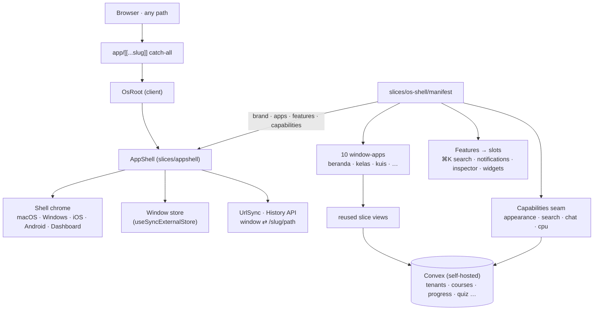

# PRD — belajar-with-rahmanef.com

> v0.1 · 2026-07-05 · Status: **draft untuk review Rahman**
> v0.2 · 2026-07-07 · **Delivery pivot:** frontend jadi OS desktop shell berjendela (lihat §11). Domain produk (multi-tenant · Kelas→Modul→Lesson · quiz · progress · badge · Discord-first) & Convex backend **tidak berubah**.
> Sumber: [DECISIONS.md](../DECISIONS.md) (20 Q&A). Teknis: [DATA-MODEL.md](DATA-MODEL.md), [SLICES.md](SLICES.md).

## 1. Problem statement

Banyak orang Indonesia non-IT ingin memakai AI untuk kehidupan sehari-hari, pekerjaan, dan usaha — tapi materi yang ada tersebar, berbahasa Inggris, atau terlalu teknis (fundamental/coding). Belum ada tempat belajar **pengaplikasian AI** berbahasa Indonesia yang gratis, terstruktur (kelas, progress, komunitas), dan terbuka bagi pengajar sukarelawan lain untuk ikut membuka kelas. Tanpa ini, orang belajar sporadis dari video acak tanpa arah dan tanpa komunitas.

## 2. Prinsip produk (tidak bisa ditawar)

1. **Charity.** Gratis untuk peserta & pengajar. Biaya berjalan ≈ Rp0 di luar VPS + domain yang sudah ada.
2. **Tumpang di tools gratis.** Video di YouTube (embed), diskusi di Discord. Platform hanya menyimpan struktur, materi teks, dan progress.
3. **Aplikasi, bukan fundamental.** Materi fundamental ditaut ke resource eksternal yang proper.
4. **Bahasa Indonesia**, istilah teknis tetap Inggris.

## 3. Persona & role

| Persona | Role | Kebutuhan inti |
|---|---|---|
| Pembelajar umum non-IT | member | belajar terstruktur, tahu progress-nya, tempat bertanya (Discord) |
| Pengajar sukarelawan | instructor | bikin & kelola kelas tanpa mikir infrastruktur |
| Penggerak komunitas | owner (tenant) | buka "sekolah" sendiri, kelola pengajar & member |
| Rahman | platform admin | kurasi komunitas baru, jaga kualitas, biaya tetap nol |

Target audiens campuran multi-track (umum / kerja / konten-UMKM) — tiap track diwujudkan sebagai kelas (atau komunitas) terpisah, ditambah bertahap.

## 4. Goals

- **G1 Aktivasi:** ≥40% pendaftar menyelesaikan ≥1 lesson dalam 7 hari pertama.
- **G2 Penyelesaian:** ≥25% member yang memulai kelas menyelesaikannya dalam 60 hari.
- **G3 Komunitas:** ≥100 member terdaftar dalam 3 bulan pasca-launch, organik.
- **G4 Multi-tenant terbukti:** ≥1 komunitas eksternal (bukan milik Rahman) aktif dalam 3 bulan setelah v1.1.
- **G5 Biaya:** biaya bulanan tetap ≤ biaya VPS + domain existing.

## 5. Non-goals (v1–v1.1)

- **Video hosting sendiri** — YouTube embed saja (biaya bandwidth/storage).
- **Chat/forum in-app** — Discord-first; komentar per lesson baru fase 2.
- **Pembayaran/monetisasi** — charity, tidak ada rencana.
- **Email notifikasi** — in-app + Discord webhook dulu.
- **Sertifikat PDF** — badge profil cukup.
- **Aplikasi mobile** — web responsive mobile-first.

## 6. User stories (urut prioritas per persona)

**Member**
- Sebagai calon member, aku ingin login dengan akun Google agar bisa gabung tanpa membuat password baru.
- Sebagai member, aku ingin join komunitas dan melihat daftar kelasnya agar tahu mulai dari mana.
- Sebagai member, aku ingin menonton video lesson + membaca materi + membuka link resource dalam satu halaman.
- Sebagai member, aku ingin menandai lesson selesai dan melihat progress bar per modul & kelas agar tahu sejauh mana perjalananku.
- Sebagai member, aku ingin mengerjakan quiz pilihan ganda dan langsung tahu skorku.
- Sebagai member, aku ingin mengusulkan link resource dan topik/kelas baru agar ikut membangun komunitas.
- Sebagai member, aku ingin badge kelulusan tampil di profil publikku agar bisa kubagikan.

**Instructor**
- Sebagai instructor, aku ingin membuat kelas → modul → lesson dengan menempel URL YouTube + menulis markdown, tanpa upload file.
- Sebagai instructor, aku ingin mengkurasi (approve/reject) resource & usulan dari member.
- Sebagai instructor, aku ingin memasang quiz MCQ per modul yang dinilai otomatis.
- Sebagai instructor, aku ingin memposting pengumuman yang otomatis terkirim ke channel Discord komunitas.

**Owner**
- Sebagai owner, aku ingin mengajukan komunitas baru dan mengatur profilnya (nama, deskripsi, link invite Discord, webhook).
- Sebagai owner, aku ingin mengangkat member menjadi instructor.

**Platform admin**
- Sebagai platform admin, aku ingin meninjau dan meng-approve/menolak pengajuan komunitas agar platform tetap sehat.

## 7. Requirements

### P0 — v1 (tidak launch tanpa ini)

| # | Requirement | Acceptance criteria (ringkas) |
|---|---|---|
| R1 | Auth Google via @convex-dev/auth | login/logout jalan; profil auto-terbuat saat login pertama; tidak ada opsi password |
| R2 | Landing page | menjelaskan platform, menampilkan komunitas & kelas aktif, CTA login/join; mobile-first |
| R3 | Tenant & membership (skema full multi-tenant; UI: join + halaman komunitas; komunitas pertama di-seed) | user bisa join komunitas aktif; role tersimpan; halaman `/t/[slug]` tampil; info dasar komunitas terlihat publik, konten kelas butuh join |
| R4 | Kelas → Modul → Lesson (kelola + belajar) | instructor CRUD; lesson = YouTube embed + markdown + daftar link; draft tidak terlihat member; urutan modul/lesson bisa diatur |
| R5 | Progress | tombol "tandai selesai" idempoten; progress bar per modul & kelas akurat; penyelesaian kelas tersimpan saat semua lesson selesai |
| R6 | Routing multi-tenant `/t/[slug]` | slug unik; tenant non-aktif tidak bisa diakses; guard role di halaman kelola |

> **Superseded (v0.2 delivery):** R2 (landing `/`) & R6 (routing `/t/[slug]`) — halaman ber-route diganti OS desktop + catch-all mount + deep-link URL. Semantik requirement (guard role, slug unik, tenant non-aktif tertutup, landing menjelaskan platform) tetap; hanya bentuk URL/host-nya berubah. R3 halaman komunitas kini app **Komunitas** di `/komunitas/<tenant>`. Lihat §11.4.

### P1 — v1.1 (fast follow)

| # | Requirement | Catatan |
|---|---|---|
| R7 | Pengajuan komunitas + approval admin | form request → antrian di `/admin` → approve/reject |
| R8 | Resource board submit→kurasi | pending hanya terlihat instructor+ & pengusul; anti-spam ringan |
| R9 | Suggestion box usulan kelas/topik | pola sama dengan R8 |
| R10 | Quiz MCQ auto-graded, opsional per modul | jawaban benar tidak pernah terkirim ke client sebelum submit |
| R11 | Profil publik `/u/[username]` + badge | badge = penyelesaian kelas; bisa dibagikan |
| R12 | Pengumuman + Discord webhook | tampil in-app, auto-post ke Discord; webhook URL tidak pernah bocor ke client |
| R13 | Owner kelola role (member → instructor) | dari halaman kelola komunitas |

> **Superseded (v0.2 delivery):** R11 profil publik `/u/[username]` kini app **Profil** di `/profil/<username>`; R13 kelola role kini app **Kelola** di `/kelola/<tenant>`. Requirement domain tetap; lihat §11.4.

### P2 — fase 2 (jangan sampai arsitektur menghalangi)

Komentar per lesson · role Moderator/TA · subdomain per tenant · email (Resend) · upload file kecil dengan kuota per tenant · vote pada usulan · sertifikat PDF + verifikasi · bilingual penuh.

## 8. Success metrics

- **Leading (harian/mingguan):** signup→join rate; aktivasi 7 hari (G1); lesson selesai per minggu; submission resource/usulan (v1.1).
- **Lagging (bulanan):** member aktif bulanan; kelas selesai kumulatif; komunitas aktif; retention 30 hari.
- **Cara ukur:** query Convex sederhana (index sudah disiapkan); awalnya manual/script, dashboard admin kecil menyusul fase 2.
- **Evaluasi:** 1 minggu, 1 bulan, 3 bulan pasca-launch.

## 9. Open questions

| Pertanyaan | Pemilik | Blocking? |
|---|---|---|
| Nama & branding komunitas pertama | Rahman | sebelum launch (tidak blocking dev) |
| VPS Dokploy: spek cukup untuk Convex self-hosted (Docker)? sudah pernah jalan? | Rahman | blocking **deploy**, tidak blocking dev |
| Channel YouTube tempat video kelas | Rahman | sebelum produksi konten |
| Kurikulum detail kelas #1 ("AI untuk sehari-hari") | Rahman + Claude | paralel dengan build |
| Aturan komunitas / kode etik tertulis | Rahman | sebelum v1.1 (buka tenant eksternal) |

## 10. Rilis

| Rilis | Isi | Estimasi effort |
|---|---|---|
| **v1 (launch)** | R1–R6: scaffold, auth, tenant seed, kelas, progress, landing | 3–5 sesi kerja |
| **v1.1** | R7–R13: approval, resources+usulan, quiz, profil+badge, pengumuman | 4–6 sesi kerja |
| **Fase 2** | sesuai demand komunitas | — |

Urutan build teknis & definition of done: lihat [SLICES.md](SLICES.md).

## 11. Antarmuka & delivery — OS desktop (v0.2, 2026-07-07)

> **Perubahan delivery, bukan domain.** Sejak commit OS pivot, frontend tidak lagi berupa halaman ber-route (`app/(public)`, `app/t/[slug]`, `app/u/[username]` — **dihapus**). UI sekarang satu **OS desktop berjendela** di atas framework `slices/appshell`. **Semua requirement R1–R13, prinsip produk (§2), dan Convex backend (skema, tabel, authz, `convex/features/<slice>`) TIDAK berubah** — yang berganti hanya "kulit"/host antarmukanya (route → jendela OS). [DATA-MODEL.md](DATA-MODEL.md) masih valid.

### 11.1 Mount tunggal (catch-all)

Satu route catch-all `app/[[...slug]]/page.tsx` merender desktop untuk **setiap** path (`routing: true`, sinkronisasi URL via History API). `app/admin` + `app/api` tetap. Integrasi lewat `slices/os-shell/` (`manifest.tsx` = brand + apps + features + capabilities, `capabilities.ts` = data seam, `os-root.tsx` = mount `<AppShell>`, `apps/` = window-apps + `_nav.ts`).

### 11.2 Sepuluh window-app

Tiap app adalah wrapper tipis yang **memakai ulang** view slice + query Convex yang sudah ada (tidak ada logika domain ditulis ulang):

beranda · komunitas · kelas · kuis · profil · resources · pengumuman · kelola · pengaturan · masuk.

Shell chrome bisa diganti (macOS · Windows · iOS · Android · Dashboard) via Pengaturan → "Tampilan OS". Ini menegaskan — bukan membatalkan — non-goal §5 "web responsive mobile-first": tetap web responsif, kini dengan skin desktop & mobile.

### 11.3 Deep-link URL (shareable, round-trip via URL-sync)

| URL | Membuka |
|---|---|
| `/` · `/beranda` | Beranda (auto-buka saat cold boot) |
| `/komunitas` · `/komunitas/<tenant>` | direktori komunitas / satu komunitas |
| `/kelas/<tenant>/<course>[/lesson/<id>]` | kelas + lesson |
| `/kuis/<tenant>/<course>/<module>` | quiz |
| `/profil/<username>` | profil publik |
| `/resources/<tenant>` · `/pengumuman/<tenant>` · `/kelola/<tenant>` | surface komunitas |
| `/pengaturan` · `/masuk` | pengaturan / login |

`openApp(id, title, [segs])` (di `apps/_nav.ts`) meng-encode param ke `payload.path`; UrlSync appshell mencerminkannya ke address bar, dan link yang di-paste membuka ulang jendela yang sama.

### 11.4 Remap route lama → OS app (superseded)

| Lama (dihapus) | Sekarang |
|---|---|
| Landing `/` (R2) | app **Beranda** (auto-buka) |
| `/t/[slug]` (R3, R6) | app **Komunitas** · `/komunitas/<tenant>` |
| `/u/[username]` (R11) | app **Profil** · `/profil/<username>` |
| halaman kelola tenant (R13) | app **Kelola** · `/kelola/<tenant>` |

Acceptance criteria domain di §7 tetap berlaku; hanya bentuk URL/host-nya yang berubah seperti tabel di atas.

### 11.5 Arsitektur

### 11.6 Catatan

- **Design:** bespoke "Editorial Warmth" (Fraunces + Hanken, terracotta oklch tokens); shell chrome ikut preset tweakcn aktif via remap token di `app/globals.css` (glass/window/dock → `--card`/`--radius`).
- **Capabilities seam** (`manifest.capabilities`, 4/7 wired): appearance (next-themes) · search (course + community) wired; chat = placeholder "coming soon"; cpu = stub. Omit systemStats & serverToggle (tak ada padanan learning).
- **AI tutor asli DITUNDA** — butuh `ANTHROPIC_API_KEY` di backend Convex self-hosted + `convex deploy` manual, lalu ganti `chatComingSoon` dengan httpAction. Tercermin di §9 open questions (pemilik: Rahman).
- **Deploy:** Dokploy webhook on `git push origin main` → build → deploy. Convex self-hosted **tidak** auto-deploy dari push — perubahan `convex/` butuh `npx convex deploy` manual. Live: https://study-with.rahmanef.com.
