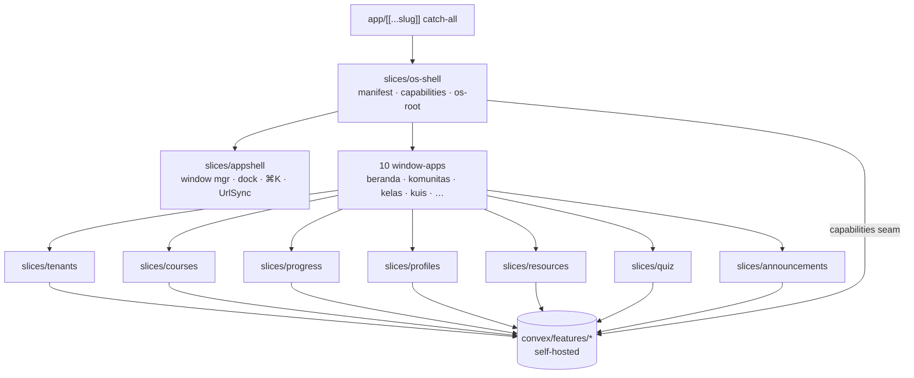

# Rencana Vertical Slice

> Konvensi rr berlaku penuh: `slices/<slug>/` + `convex/features/<slug>/`, metadata pair, barrel-only imports, ≤200 LOC/file, props-driven.
> **Copy-first (P1):** katalog rr = https://resource.rahmanef.com (69 slices; JSON: `/api/knowledge`; prompt per-slice: `/agents/<slug>`). Pemetaan kebutuhan→slice yang sudah diverifikasi ada di [AGENTS.md](../AGENTS.md) §3 — `convex-auth`, `dashboard-shell`, `marketing-chrome`, `library`, `rate-limit`, dll. Copy + sanitasi, jangan greenfield. Jika sumber tidak tersedia: STOP dan tanya.

> **PIVOT OS (2026-07, HEAD `1cb407d`).** Frontend chrome dirombak dari **situs multi-tenant berbasis route** menjadi **OS desktop shell**. **Backend Convex TIDAK berubah** — schema, tabel, authz, dan `convex/features/<slug>` sama persis; [DATA-MODEL.md](DATA-MODEL.md) masih valid. Yang berubah hanya *host* frontend: route asli → window-app. Domain slice tetap punya convex function + view presentasional; hanya cara memasangnya yang beda. Dua lapisan frontend baru ditambahkan: `slices/appshell` (framework OS-shell vendored) + `slices/os-shell` (lapisan integrasi). Route group lama `app/(public)`, `app/t/[slug]`, `app/u/[username]` **DIHAPUS**, diganti satu catch-all `app/[[...slug]]`. Detail di §Peta route & guard.

## Daftar slice

### Slice domain (backend UNCHANGED — host berubah route → window-app)

Kolom **Route utama** lama sudah **RETIRED**: tiap surface domain sekarang jadi *window-app* di OS shell, di-deep-link lewat skema URL (lihat §Peta route & guard). Convex table + tanggung jawab tidak berubah.

| Slice | Rilis | Tanggung jawab | Tabel Convex | Window-app · deep-link |
|---|---|---|---|---|
| `tenants` | v1 (form request + approval UI → v1.1) | profil komunitas, join, membership + role, approval | tenants, memberships | `komunitas` (`/komunitas`, `/komunitas/<tenant>`), `kelola` (`/kelola/<tenant>`); admin real-route `/admin/komunitas` |
| `courses` | v1 | CRUD kelas/modul/lesson; viewer lesson (YouTube + markdown + links) | courses, modules, lessons | `kelas` (`/kelas/<tenant>/<course>[/lesson/<id>]`); tab di `kelola` |
| `progress` | v1 | tandai selesai, progress bar, penyelesaian kelas | lessonCompletions, courseCompletions | embed di `kelas` (progress ring di kartu + player) |
| `profiles` | v1 minimal · publik + badge v1.1 | profil user, username, badge wall | profiles | `profil` (`/profil/<username>`); edit di `pengaturan` |
| `resources` | v1.1 | resource board + suggestion box (submit → kurasi) | resources, suggestions | `resources` (`/resources/<tenant>`) |
| `quiz` | v1.1 | builder MCQ, pengerjaan, auto-grade | quizzes, quizAttempts | `kuis` (`/kuis/<tenant>/<course>/<module>`); tab builder di `kelola` |
| `announcements` | v1.1 | pengumuman in-app + internal action Discord webhook | announcements | `pengumuman` (`/pengumuman/<tenant>`); toast + badge di dock icon Komunitas |

### Slice frontend OS (baru — pivot 2026-07, frontend-only, tanpa tabel Convex)

| Slice | Rilis | Tanggung jawab | Isi utama |
|---|---|---|---|
| `appshell` | OS pivot (`89c4434`) | **Framework OS-shell vendored.** 5 shell switchable (macOS · Windows · iOS · Android · Dashboard); window manager (store `useSyncExternalStore`, snap/split-view), dock, launcher, ⌘K Spotlight, notifications, inspector (⌘I), widgets, UrlSync (History API, window ⇄ URL). Core tidak tahu apa-apa soal domain — semua di-*inject* lewat manifest. | `config.ts`, `defaults.ts` (`DEFAULT_FEATURES`), `features/`, `runtime/`, `registry/`, `provider/`, `responsive/`, `primitives/`, `appshell.css` |
| `os-shell` | OS pivot (`89c4434`) → deep-links (`5094760`) → P1–P3 (`b6479a2`…`1cb407d`) | **Lapisan integrasi** yang men-drive `appshell` dengan realitas learning. Deklarasi brand + 10 app + features + capabilities; mount `<AppShell>`; jembatan ke view slice + query Convex (tanpa nulis ulang domain logic). | `manifest.tsx`, `capabilities.ts`, `os-root.tsx`, `apps/` (10 window-app + `_nav.ts`), `shell-search.ts`, `shell-commands.tsx`, `shell-activity.tsx`, `learning-widgets.tsx`, `recent-courses.ts`, `boot-beranda.tsx` |

**10 window-app** (`slices/os-shell/apps/`, urutan manifest): `beranda` · `komunitas` · `kelas` · `kuis` · `resources` · `pengumuman` · `kelola` · `profil` · `pengaturan` · `masuk`. Tiap app = thin client wrapper yang **me-reuse view slice + query Convex existing** (no domain logic rewritten). `_nav.ts` mengekspor `openApp(id, title, [segs])` (encode param → `payload.path`) + `seg(payload)` (parse balik).

**Capabilities seam** (`manifest.capabilities` = `editorialCapabilities`) — 4/7 wired: `appearance` (next-themes) · `cpu` (null stub) · **`search`** (Convex course + community) · **`chat`** ("coming soon" placeholder). Dihilangkan: `systemStats`, `serverToggle` (tak ada analogi learning). Ini titik injeksi yang menyalakan fitur shell.

**Features** = `DEFAULT_FEATURES` (appshell) minus `widgets`, plus `learningWidgetsFeature` (mobile Today). Meng-aktifkan ⌘K search · command palette · notifications/toast · inspector.

Setiap slice: `components/ lib/ utils/ hooks/ config/ api/` + `types.ts` + tests + `slice.json` (dengan blok `contract`) + `slice.manifest.json` (versi sinkron). (Slice frontend OS tetap punya metadata pair; DoD authz-denied N/A karena tak punya convex function — lihat §Definition of done.)

## Peta dependensi slice (OS)

Aliran: catch-all merender `os-shell` → `os-shell` menyuntik manifest ke `appshell` (core) DAN memasang 10 window-app → window-app me-reuse view domain slice → domain slice memanggil `convex/features/*`. `appshell` **tidak** import slice domain (di-inject via manifest); dependensi searah, tanpa siklus.

## App-level (bukan slice)

- `app/[[...slug]]/page.tsx` — **satu catch-all** merender `<OsRoot/>` (dari `os-shell`) untuk SETIAP path. `routing: true`; appshell mirror window fokus ke URL via History API, baca `window.location` di client → tetap statically prerenderable (Cache Components). Next serve `/_next/*` + aset app-root (icon/opengraph) lewat handler lebih spesifik, tak sampai ke sini.
- `app/admin/` — platform admin (konsumsi api slice `tenants`); **tetap real route** `/admin/komunitas` (bukan window-app).
- `app/api/` — mis. `/api/version`. Tetap.
- `proxy.ts` (bukan middleware.ts), theme tokens, `convex/_shared/auth.ts`, `convex/schema.ts` (komposisi dari DATA-MODEL.md).
- `app/globals.css` — token remap: chrome shell (glass/window/dock) ikut preset tweakcn aktif (`--card`/`--radius`/font). Desain bespoke **"Editorial Warmth"** (Fraunces + Hanken, token oklch terracotta).
- **DIHAPUS pada pivot:** `app/(public)/` (landing + `/login` + `/u/[username]`), `app/t/[slug]/` (shell komunitas), `app/u/[username]/`. Fungsinya pindah jadi window-app (`beranda`/`masuk`/`profil` dst.).

## Peta route & guard

> **RETIRED (superseded oleh pivot OS).** Tabel route asli di bawah dipertahankan sebagai catatan sejarah — semua path ini **tidak lagi jadi route Next**; sekarang jadi *deep-link* yang di-round-trip lewat UrlSync appshell (satu catch-all). Guard = UX; keamanan tetap di authz Convex per function.

Tabel route lama (HISTORIS — route group `app/(public)`, `app/t/[slug]`, `app/u/[username]` sudah dihapus):

| Route (LAMA, retired) | Halaman | Guard | Sekarang jadi |
|---|---|---|---|
| `/` | landing: etalase komunitas & kelas aktif | publik | `beranda` (auto-open cold boot) |
| `/login` | Google OAuth | publik | `masuk` (`/masuk`) |
| `/u/[username]` | profil publik + badge | publik | `profil` (`/profil/<username>`) |
| `/t/[slug]` | beranda komunitas | publik (etalase) | `komunitas` (`/komunitas/<tenant>`) |
| `/t/[slug]/kelas/[kelasSlug]` | overview kelas + silabus | publik (judul/silabus) | `kelas` (`/kelas/<tenant>/<course>`) |
| `…/belajar/[lessonId]` | lesson player | member | `kelas` (`/kelas/<tenant>/<course>/lesson/<id>`) |
| `/t/[slug]/resources`, `/usulan`, `/pengumuman` | papan komunitas | member (submit) | `resources` (`/resources/<tenant>`), `pengumuman` (`/pengumuman/<tenant>`) |
| `/t/[slug]/kelola/**` | dashboard instructor/owner | instructor+ | `kelola` (`/kelola/<tenant>`), tab kelas/kuis |
| `/admin/**` | approval komunitas, daftar tenant | platform admin | **tetap real route** `/admin/**` |

### Skema deep-link (BERLAKU — window-app + UrlSync)

Setiap window-app di-deep-link; link bisa di-share dan re-open window yang sama (round-trip via `payload.path` ⇄ address bar).

| URL | Membuka |
|---|---|
| `/` · `/beranda` | Beranda (auto-open saat cold boot) |
| `/komunitas` · `/komunitas/<tenant>` | direktori komunitas / satu komunitas |
| `/kelas/<tenant>/<course>[/lesson/<id>]` | kelas + lesson |
| `/kuis/<tenant>/<course>/<module>` | kuis |
| `/profil/<username>` | profil publik |
| `/resources/<tenant>` · `/pengumuman/<tenant>` · `/kelola/<tenant>` | surface komunitas |
| `/pengaturan` · `/masuk` | pengaturan / sign-in |

`openApp(id, title, [segs])` (`apps/_nav.ts`) meng-encode param ke `payload.path`; UrlSync appshell mirror ke address bar; link yang di-paste re-open window yang sama. Guard route = UX saja; keamanan sesungguhnya di authz Convex per function (P0, lihat DATA-MODEL.md).

## Data fetching (pola per halaman)

- Halaman authed/dinamis: server component `preloadQuery` → client `usePreloadedQuery` (reaktif, tanpa loading flash). Di OS, window-app adalah client wrapper — reuse hook/query slice yang sama.
- Landing (statis): `"use cache"` + `fetchQuery` daftar komunitas aktif (dipakai `beranda` + `komunitas`).
- Mutation: hooks slice-lokal (`slices/<slug>/hooks/`), error `ConvexError.code` → copy user-facing via toast (sonner).
- **Tidak ada fetch di `useEffect`.**

## Urutan build

| Langkah | Isi | Rilis |
|---|---|---|
| 0 | Scaffold copy-first: Next 16 + Tailwind v4 + Convex self-host dev + @convex-dev/auth (Google) + shadcn + shell + proxy.ts | — |
| 1 | Slice `tenants` (skema penuh + seed komunitas pertama; tanpa form request) | v1 |
| 2 | Slice `courses` | v1 |
| 3 | Slice `progress` + `profiles` minimal | v1 |
| 4 | Landing + polish + e2e smoke → **LAUNCH v1** | v1 |
| 5 | `tenants` request-form + `/admin` approval | v1.1 |
| 6 | Slice `resources` (board + usulan) | v1.1 |
| 7 | Slice `quiz` | v1.1 |
| 8 | `profiles` publik + badge wall | v1.1 |
| 9 | Slice `announcements` (+ webhook action) | v1.1 |
| 10 | **Pivot OS**: vendor `appshell` + integrasi `os-shell` (catch-all, 10 window-app, deep-link, capabilities seam). Frontend-only, **tanpa perubahan convex.** Trail: `89c4434` → `5094760` → `b1a38f4` → P1 `b6479a2` → P2 `510b1c0` → P3 `1cb407d`. | OS |

## Definition of done — per slice

- `npx tsc --noEmit` hijau.
- `convex-test`: setiap mutation/query diuji, **termasuk jalur authz-denied** (caller tanpa auth/role ditolak) — P0. (Slice frontend OS `appshell`/`os-shell` tak punya convex function → butir authz-denied N/A; tetap wajib metadata pair + file-size.)
- Test barrel API (kontrak yang dipakai konsumen).
- Metadata pair versi sinkron (`audit:slices`); tak ada file >200 LOC (`audit:file-size`).
- Tidak ada import lintas-slice selain via barrel; tidak ada hardcode URL/copy (props-driven). `appshell` tetap domain-agnostic (semua di-inject via manifest `os-shell`).

## Pra-launch v1 (app-level)

- Playwright smoke: login → join komunitas → buka lesson → tandai selesai → progress naik. (Pasca-pivot: alur ini berjalan di dalam window-app OS — `masuk` → `komunitas` → `kelas`.)
- `error.tsx` + `not-found.tsx` (root `app/`) — route group lama sudah dihapus, catch-all pakai boundary root.
- Cek `check:stack-pin`; commit conventional; risky change → staging dulu (`git push origin main:staging` → `e2e:staging` → main).
