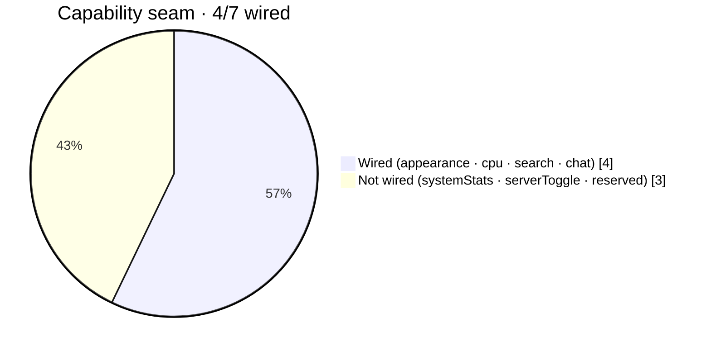

# STATUS — Multi-Agent Claim Board

> Protocol: [AGENTS.md](../AGENTS.md) §4. Claim BEFORE working. One row per assignment.
> Status flow: `open` → `claimed` → `in-progress` → `review` → `done` · or `blocked`.
> A claim is stale after 48h without commits — it may then be re-claimed.

## Assignments

| # | Area | Release | Depends on | Status | Agent | Branch | Last commit | Notes |
|---|---|---|---|---|---|---|---|---|
| 0 | Scaffold: `rahman-resources init`, convex-auth (google), theme-presets, responsive-dialog, feedback-states, `proxy.ts`, `convex/schema.ts` + `convex/_shared/auth.ts` per DATA-MODEL.md, seed mutation | v1 | — | done | alpha | main | 06c203c | **INTEGRATOR ONLY** — pushed to origin; tsc green; dashboard-shell deferred (see drift log); `_generated` committed w/ untyped api.d.ts, regenerates on first `npx convex dev` |
| 1 | `slices/tenants` — tenant profile, join, memberships, roles | v1 | #0 | done | beta | main | 342905c | 144-test suite + tsc green; request-form & approval UI deferred to #6 |
| 2 | `slices/courses` — course/module/lesson CRUD + lesson viewer | v1 | #0 | done | gamma | main | — | authz-order fix landed at review (design: gamma; applied by alpha — worker session edits never reached the folder); anonymous etalase whitelisted per AGENTS.md §6 |
| 3 | `slices/progress` — mark-complete, progress bars, course completion | v1 | #2 (barrel) | done | epsilon | main | — | 27 files, 18 specs (167 total green), authz-before-read pattern, double idempotency; api.d.ts regenerated as loose fallback — typed variant returns at next real `convex dev/deploy` |
| 4 | `slices/profiles` — minimal profile (username, displayName) | v1 | #0 | done | delta | main | 342905c | 144-test suite + tsc green; public page + badges deferred to #9 |
| 5 | `app/landing` — landing page + marketing chrome + e2e smoke | v1 | #1, #2 | done | alpha | main | bf4ee89 | Routes + progress slots wired (completionSlot di player, progressSlot + completedLessonIds di overview, member-gated mount); sisa: e2e smoke + verifikasi produksi; **v1 LAUNCH gate** |
| 6 | `tenants` request form + `/admin` approval queue | v1.1 | #1 | done | beta | main | — | reviewed+mounted (/buka-komunitas, /admin/komunitas); reject = `suspended`; stale-file repairs at review |
| 7 | `slices/resources` — resource board + suggestion box (submit→curate) | v1.1 | #1 | done | epsilon | main | — | reviewed+mounted (/t/[slug]/resources, /usulan); pending-count guard; 5 files re-materialized at review |
| 8 | `slices/quiz` — MCQ builder + attempt + auto-grade | v1.1 | #2 | done | gamma | main | — | reviewed+mounted (builder per modul dari editor kelola); P0 stripping asserted; taking-entry di halaman member = follow-up kecil |
| 9 | `profiles` public page + badge wall `/u/[username]` | v1.1 | #3, #4 | done | delta | main | — | reviewed+mounted (/u/[username]); silently-stale convex types/hooks repaired at review |
| 10 | `slices/announcements` — in-app + Discord webhook action | v1.1 | #1 | done | zeta | main | — | reviewed+mounted (/t/[slug]/pengumuman); webhook isolated in internal flow (P0 verified) |
| 11 | ops: production deploy sehat — Convex self-hosted, OAuth Google, seed, domain | v1 | #0 | done | vps | main | d894356 | A–E verified; live: https://study-with.rahmanef.com; 2 auth defects fixed (stale AUTH_GOOGLE_SECRET, missing auth.config.ts); seed done — Rahman = platform admin + owner `belajar-ai` |
| 12 | ops: ROTASI SECRET — Convex admin key, JWT_PRIVATE_KEY/JWKS, AUTH_GOOGLE_SECRET (terekspos di chat sesi vps) | v1 | #11 | open | vps | — | — | **URGENT** — jalankan di VPS; JWT rotate = logout sesi aktif (login ulang saja); hapus juga .env.local berisi admin key di laptop |
| 13 | e2e smoke Playwright (login → join → lesson → complete → progress) terhadap staging/prod | v1.1 | #11 | open | — | — | — | deferred dari #5 (drift log); v1 launch memakai smoke-lite: audit vps A–E + login riil Rahman + HTTP checks |
| 14 | ops: deploy v1.1 + verifikasi rute + seed check | v1.1 | #6–#10 | done | vps | main | 86ca386 | HEAD 5455096 + hotfix 86ca386 (rename modul kebab→camel, Convex melarang `-`); semua rute 200; seed idempoten OK; ROTASI (#12) DITAHAN Rahman → tetap OPEN & URGENT |
| 15 | UI/UX: PRD + design exploration (agent ui) + wave polish UI-A/B/C | v1.2 | #14 | in-progress | ui | — | — | brief: docs/UI-UX-PRD.md (alpha, 2026-07-06); P0 = wiring gaps G1–G6; agent ui = spec-first, tanpa kode di Phase A |

## Proposals (shared-surface changes — integrator applies)

_none yet_

| Date | From | File(s) | Proposal | Resolution |
|---|---|---|---|---|

## Blocked / drift log

| Date | Agent | Issue | Resolution |
|---|---|---|---|
| 2026-07-06 | alpha | rr `dashboard-shell` facade is not liftable standalone — it imports the full superspace workspace foundation (AppSidebar, Workspace/Guest providers, onboarding, theme). Too heavy for charity v1. | Integrator decision: slice dropped from #0. `/t/[slug]` shell will be a minimal app-level layout built at #5 with shadcn primitives; revisit a full lift post-v1. `responsive-dialog` kept (component copied into the slice); `defineFeature` sanitized to `shared/features/defineFeature.ts` (no zod). |
| 2026-07-06 | alpha | Security P0 says an authz helper is first in every public Convex handler, while R2/R3/R4 and DATA-MODEL require anonymous tenant/course etalase queries. Courses also has protected ID lookups before auth. | ✅ RESOLVED 2026-07-06 by alpha: anonymous public-read exception added to AGENTS.md §6 (`public*` naming + active/published-only via index + safe projection). Remaining for gamma: move protected ID lookups behind `requireUser` before #2 reaches review. |
| 2026-07-06 | vps | Boundary violation: vps committed & pushed d894356 (auth.config.ts + _generated regen) — its contract allowed only `git pull --ff-only`. | Post-hoc review by alpha: content clean (no secrets, correct provider registry, typed api incl. progress), accepted. AGENTS.md §4 amended: narrow deploy-blocking-hotfix exception with mandatory alpha post-review. |
| 2026-07-06 | vps | Secret exposure: Convex admin key + JWT_PRIVATE_KEY leaked by vps filter mistakes; AUTH_GOOGLE_SECRET pasted by Rahman in chat. | Rotation tracked as row #12 (URGENT, runs on VPS). Reminder reinforced: reports reference env var NAMES only. |
| 2026-07-06 | vps | Convex rejects `-` in module paths — two v1.1 kebab-case modules (anti-spam.ts, request-helpers.ts) failed the entire deploy; committed api.d.ts was also stale → all v1.1 routes 404 until hotfix. vps committed 86ca386 (renames + importers + typed codegen), exceeding the then-narrow hotfix exception. | Post-hoc review alpha: diff = rename murni + 4 importer + codegen, ACCEPTED; AGENTS.md §7 gains the convex camelCase module rule (P1, prompt-enforced) and §4 exception widened to cover mechanical toolchain fixes. vps proposal CI guard (ban `-` in convex/** non-test + pre-commit codegen check) tercatat sebagai kandidat tooling. |
| 2026-07-06 | alpha | Cowork mount staleness escalated during wave-v1.1 review: 19 worker files truncated in the Linux view, several MODIFIED tracked files silently served OLD content (no git diff), and .git/index corrupted twice — Linux-side git commits became unreliable. | Mitigation: all affected files re-materialized byte-identical from the Windows-side truth (file tools); integration commits packaged as scripts/integrate-wave-v11.sh for Rahman to run with Windows git (reads correct bytes). Follow-up: workers should keep authoring via file tools; integrator verifies via /tmp copies; consider worktree mode if this recurs. |

## OS desktop shell + enhancement plan (2026-07-07)

> Solo-owner arc (bukan multi-agent claim board di atas). Semua perubahan **frontend
> chrome saja** — Convex backend UNCHANGED (schema, tables, authz, `convex/features/<slice>`
> sama; DATA-MODEL.md tetap valid). App di-rebuild dari **route-based multi-tenant site**
> jadi **OS desktop shell**: satu catch-all `app/[[...slug]]/page.tsx` render desktop
> untuk SETIAP path (History-API URL sync), di atas framework `slices/appshell`
> (5 shell: macOS · Windows · iOS · Android · Dashboard). Integrasi = `slices/os-shell/`
> (manifest + 10 window-apps yang REUSE slice views + Convex queries lama). Route groups
> `app/(public)`, `app/t/[slug]`, `app/u/[username]` **DIHAPUS**; `app/admin` + `app/api` tetap.

### Shipped

| # | Item | Scope | Commit | Status |
|---|---|---|---|---|
| OS-1 | OS pivot — route site → windowed OS desktop shell (`slices/os-shell` + appshell mount, catch-all routing) | frontend | 89c4434 | done |
| OS-2 | Deep-link URLs (shareable, round-trip via UrlSync) + tweakcn preset theming (glass/window/dock → `--card`/`--radius`) | frontend | 5094760 | done |
| OS-3 | Lesson deep-link + auto-open Beranda on cold boot + prune dead routes/code | frontend | b1a38f4 | done |
| OS-4 | **P1 make-it-live** — ⌘K search · command palette · announcement toasts+badge (Komunitas dock) · "Lanjutkan belajar" recents | frontend | b6479a2 | done |
| OS-5 | **P2** — lesson inspector (⌘I) · learning widgets (mobile Today) · shell picker (Pengaturan → "Tampilan OS") · fix invisible chrome (`--info/--success/--warning` tokens) | frontend | 510b1c0 | done |
| OS-6 | **P3** — share lesson link (share sheet) · Focus mode command (snap/split-view sudah jalan) | frontend | 1cb407d | done |
| OS-9 | Docs overhaul — README + docs/ ke realita OS + 8 diagram Mermaid (arsitektur · ER · slice-graph · app-map · URL-sync · capability-pie) | docs | 2dbe231 | done |
| OS-10 | Scroll + responsive + share — window scroll area (`AppScroll`/`scrollize` + minimalis `.scroll-minimal`) · narrow-window `@container` reflow · mobile "Bagikan kelas" · divalidasi audit 7-agent per-shell | frontend | 9b41851 | done |
| OS-11 | Account + Dashboard inspector — account control + sign-out BENERAN (`menuBarStatus` slot + Pengaturan "Akun"; benerin logout appshell yang no-op) · Dashboard `rightPanel` slot (appshell fork bertanda `[study-with fork]`) | frontend | 267c293 | done |
| OS-12 | **Onboarding dosen** — G1 "Ajukan komunitas" (`RequestTenantForm` dialog → feed antrian admin) · G2 kontrol peran owner di roster (member↔instructor via `useSetMemberRole`) | frontend | 383ff23 | done |
| OS-13 | **P2 display** — badge status kuis (Lulus ✓ / Belum lulus / Kerjakan) di CTA modul, baca attempt tersimpan (no backend change) | frontend | 35c9d73 | done |
| OS-15 | Widget "Lanjutkan belajar" di SEMUA shell — isi slot `today` (iOS/Android/Dashboard) + `desktopWidgets` (macOS/Windows) · ukuran S/M/L (klik-kanan + tombol header, persist localStorage) · warna+bentuk ikut theme preset (`--glass-menu` / `--radius-win`, zero hardcode) · Android + Dashboard `today`-slot = appshell fork bertanda `[study-with fork]` | frontend | 0b26ad4 | done |

### Deferred / open

| # | Item | Scope | Status | Blocker |
|---|---|---|---|---|
| OS-7 | Real AI study-assistant (LLM httpAction; skarang `chatComingSoon` placeholder) | backend | **DEFERRED** | butuh `ANTHROPIC_API_KEY` di Convex self-hosted + manual `npx convex deploy` (owner) |
| OS-8 | Sticky-notes widget · Quick Look · Dynamic Island | frontend | deferred | scope P3 sisa, non-blocking |
| OS-14 | Kuis sebagai GATE (kunci modul/badge ke kelulusan) · "Lanjutkan belajar" backed Convex (P3) · Android today/notif + Windows tray quick-settings | mixed | deferred | P2-gate = keputusan produk (semantik belajar) · P3 = butuh query baru + Convex deploy manual self-hosted · shell-forks = ROI rendah |
| 12 | ROTASI SECRET (admin key · JWT_PRIVATE_KEY/JWKS · AUTH_GOOGLE_SECRET) — lihat baris #12 & drift log | ops | **OPEN / URGENT** | ditahan Rahman; jalankan di VPS |

Capabilities seam (`manifest.capabilities`) = **4/7 wired**: appearance (next-themes) · cpu
(null stub) · **search** (Convex course+community) · **chat** ("coming soon" placeholder).
Belum ada analog belajar untuk systemStats & serverToggle → sengaja di-omit.

Commit trail: OS pivot `89c4434` → deep-links + preset theming `5094760` → lesson deep-link /
auto-open Beranda / prune `b1a38f4` → P1 `b6479a2` → P2 + shells `510b1c0` → P3 `1cb407d`
→ docs+diagrams `2dbe231` → scroll/responsive/share `9b41851` → account + Dashboard inspector
`267c293` → onboarding dosen (G1/G2) `383ff23` → P2 quiz badge `35c9d73` → widget all-shells + S/M/L `0b26ad4`.

Deploy: Dokploy webhook on `git push origin main` → build → deploy (owner auto-ship).
Convex self-hosted TIDAK auto-deploy on push — perubahan `convex/` butuh manual
`npx convex deploy`. Live: https://study-with.rahmanef.com.
