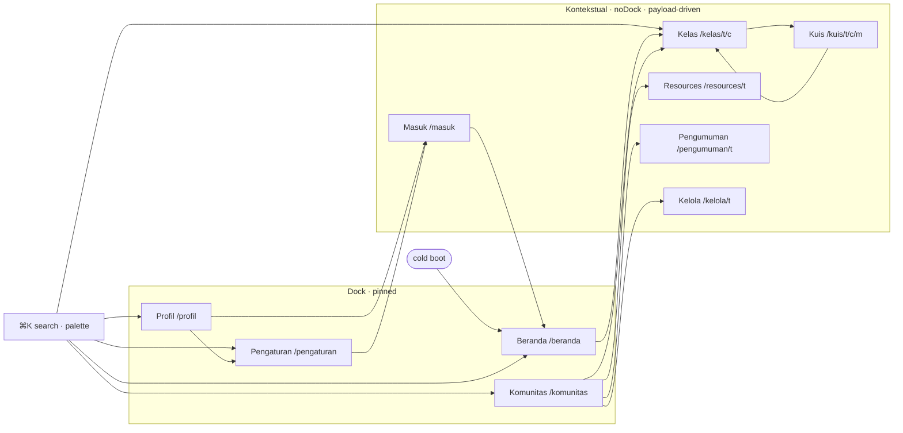
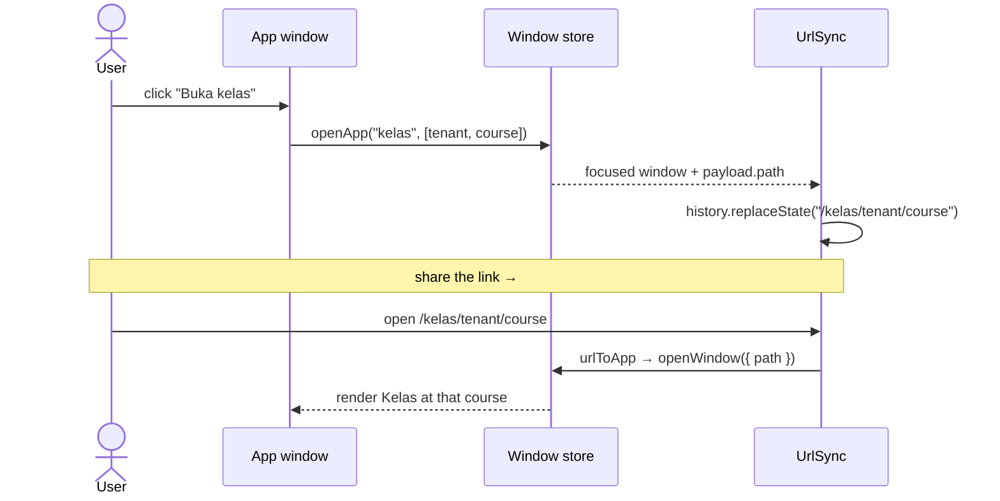

# UI/UX PRD — belajar-with-rahmanef.com (study-with.rahmanef.com)

> v3.0 · 2026-07-07 · Pemilik: alpha (integrator) · Status: **OS DESKTOP SHELL SHIPPED** (pivot dari route-based) · Editorial Warmth SHIPPED · shell features P1/P2/P3 SHIPPED
> Konteks produk: [PRD.md](PRD.md) · kontrak: [AGENTS.md](../AGENTS.md) · aturan UI rr: [rr-conventions.md](rr-conventions.md) §UI · arsitektur data: [DATA-MODEL.md](DATA-MODEL.md)
> Fokus dokumen: model UX + daftar fitur & permukaan + progres. **Chrome utama sekarang = satu OS desktop berjendela** (bukan lagi route/page per-permukaan). Deskripsi "route/page" era lama ditandai *superseded* — tidak dihapus.

## 0. Status & progres (2026-07-07)

Legenda: ✅ selesai & tayang · 🟡 sebagian/poles lanjut · ⏸️ ditunda (nilai rendah)

**Pivot besar (tayang):** aplikasi dibangun ulang dari **situs belajar berbasis-route** menjadi **OS desktop shell penuh** di atas framework vendored `slices/appshell`. Backend Convex **TIDAK berubah** (schema, tabel, authz, `convex/features/<slice>` sama) — hanya chrome frontend yang berganti: route asli → window-app. SATU catch-all `app/[[...slug]]/page.tsx` merender desktop untuk SETIAP path (`routing: true`, sinkron URL via History API). Route group lama (`app/(public)`, `app/t/[slug]`, `app/u/[username]`) **DIHAPUS**; `app/admin` + `app/api` tetap. Lapisan integrasi = `slices/os-shell/`.

**Editorial Warmth (tayang, dipertahankan):** identitas bespoke (Fraunces + Hanken, token base terracotta oklch, aset code-gen). Chrome shell mengikuti preset tweakcn aktif via remap token di `app/globals.css`. tsc bersih · **276 test hijau** · tanpa hex hardcode (kecuali aset PNG/OG + `components/brand/**`).

**Fitur shell (tayang):** ⌘K Spotlight search · command palette · toast + badge pengumuman · "Lanjutkan belajar" recents · inspector panel pelajaran (⌘I) · learning widgets (Today mobile) · **shell picker** (Pengaturan → "Tampilan OS") · share link pelajaran · Focus mode. Lihat §4.

Commit trail: OS pivot `89c4434` → deep-link + preset theming `5094760` → lesson deep-link / auto-open Beranda / prune dead code `b1a38f4` → P1 `b6479a2` → P2 + shells `510b1c0` → P3 `1cb407d`.

Riwayat pra-OS (masih valid sebagai fondasi visual/data): `742e078` overhaul "Editorial Warmth" (token base bespoke, Fraunces+Hanken, aset Logo/HeroBackdrop/favicon/OG, hapus foto stok 1.9MB, sweep responsif) · `fbaf19a` aktivasi ThemePresetSwitcher + Toaster theme-aware + mobile syllabus + quiz confirm + feedback simpan · Wave UI-A/B/C + G1–G6 (mount wave, quiz, profil, pengumuman).

**Ditunda (nilai rendah):**
- ⏸️ **AI study-assistant** — masih placeholder "coming soon" (`chatComingSoon`); LLM asli butuh `ANTHROPIC_API_KEY` di backend Convex self-hosted + `npx convex deploy` manual (swap ke httpAction). Blocker owner.
- ⏸️ Quick Look · Dynamic Island · sticky-notes widget (shell delight tambahan).
- ⏸️ Headline OG masih sans default Satori (embed byte Fraunces butuh fetch font saat build — berisiko; mark+palet sudah bawa identitas).
- ⏸️ Vendoring primitive Badge/Progress/Tooltip · data-table admin queue (@tanstack/react-table) · member count publik di header komunitas (butuh query count + deploy).

## 1. Model UX — OS desktop shell (tayang)

Bukan "satu halaman per fitur", tapi **satu desktop** yang me-mount jendela-jendela aplikasi. Alur mount:

- `app/[[...slug]]/page.tsx` (catch-all, satu-satunya route) → `OsRoot` (client) → `<AppShell manifest>` dari `@/features/appshell`.
- `slices/os-shell/manifest.tsx` = SATU tempat deklarasi brand + 10 app + features + capabilities; appshell core tidak meng-import apa pun dari domain — semua di-inject.
- **Window manager** (store via `useSyncExternalStore`, `persistKey: "study-with:os"`): buka/tutup/fokus/minimize, single-instance (buka app dengan payload baru = swap payload + refocus, bukan jendela baru), snap/split-view, dock, launcher.
- **URL-sync** (`routing: true`, History API): app yang fokus dicerminkan ke address bar; link yang di-paste re-hidrasi ke jendela yang sama (lihat §3 + Diagram B).

Ownership: seluruh `slices/os-shell/**` + `slices/appshell/**` milik **alpha** (integrator). App = thin client wrapper yang **me-reuse view slice + query Convex yang sudah ada** (tak ada domain logic ditulis ulang). Tambah app = satu `AppDescriptor` di manifest.

Lapisan integrasi `slices/os-shell/`:
`manifest.tsx` (brand + 10 app + features + capabilities) · `capabilities.ts` (data seam) · `os-root.tsx` (mount `<AppShell>`) · `apps/` (10 window-app + `_nav.ts` `openApp`/`seg`) · `shell-search.ts` (⌘K) · `shell-commands.tsx` (palette) · `shell-activity.tsx` (notifikasi) · `learning-widgets.tsx` (widget Today) · `recent-courses.ts` (recents) · `boot-beranda.tsx` (auto-open cold boot).

## 2. Lima shell yang bisa diganti + picker "Tampilan OS" (tayang)

appshell membawa **5 shell chrome** yang bisa ditukar live; identik isinya, beda gaya OS:

| Shell | Gaya | Permukaan default |
|---|---|---|
| **macOS** | menu bar + dock glass + traffic-light window | Layar lebar (desktop) |
| **Windows** | taskbar + start-launcher + window controls kanan | Layar lebar (desktop) |
| **Dashboard (Dasbor)** | sidebar/grid non-skeuomorfik | Layar lebar (desktop) |
| **iOS** | home screen + status bar + sheet | Layar sentuh (mobile) |
| **Android** | app drawer + nav bar bawah | Layar sentuh (mobile) |

**Picker** ada di app **Pengaturan → seksi "Tampilan OS"** (`apps/pengaturan-app.tsx` `ShellSection`). Pemilihan **per-surface**: `desktop` dan `mobile` dipilih terpisah (`shellsForSurface(surface)` + `setShell(surface, id)`, persist di localStorage, switch langsung). Copy: "Ganti gaya OS — macOS, Windows, Android, iOS, atau Dasbor. Berlaku langsung."

Chrome shell **mengikuti preset tema aktif** (lihat §5): warna/radius/font glass/window/dock diambil dari token preset via remap di `app/globals.css`, jadi 5 shell × ±30 preset × light/dark semuanya konsisten. Token `--info/--success/--warning` ditambahkan agar chrome tak lagi "invisible" di shell non-macOS.

## 3. Peta aplikasi — 10 window-apps (tayang)

10 app. Empat **pinned di dock** (bisa diluncurkan telanjang, punya state sendiri); enam **`noDock` / kontekstual** (payload-driven — dibuka DARI app lain lewat `openApp`, atau dari launcher entry; kalau diluncurkan telanjang cuma tampil empty "pilih satu"). `masuk` hanya relevan saat logged-out.

| App | Dock? | Deep-link URL | Dibuka dari | Me-reuse |
|---|---|---|---|---|
| **beranda** | ✅ pinned | `/` · `/beranda` | cold boot (auto-open), palette, masuk | landing/etalase + recents |
| **komunitas** | ✅ pinned | `/komunitas` · `/komunitas/<tenant>` | dock, palette, search | direktori + tenant-home slice |
| **profil** | ✅ pinned | `/profil/<username>` | dock, palette, user chip | profil publik slice |
| **pengaturan** | ✅ pinned | `/pengaturan` | dock, palette, profil | Tampilan OS + preset + form profil |
| **kelas** | ⛔ noDock | `/kelas/<tenant>/<course>[/lesson/<id>]` | beranda, komunitas, widgets, search, kuis | silabus + lesson player |
| **kuis** | ⛔ noDock | `/kuis/<tenant>/<course>/<module>` | kelas | quiz taking slice |
| **resources** | ⛔ noDock | `/resources/<tenant>` | komunitas | resources slice |
| **pengumuman** | ⛔ noDock | `/pengumuman/<tenant>` | komunitas, badge/toast | announcements slice |
| **kelola** | ⛔ noDock | `/kelola/<tenant>` | komunitas | kelola kelas/kuis/komunitas slice |
| **masuk** | ⛔ noDock | `/masuk` | komunitas/profil/pengaturan (logged-out) | sign-in |

`openApp(id, title, [segs])` (`apps/_nav.ts`) meng-encode param ke string `payload.path` (`/<slug>/<seg>/<seg>`), yang dicerminkan UrlSync ke address bar; `seg(payload)` mem-parse balik jadi segmen di sisi penerima — deep-link **shareable DAN survive reload**.

### Diagram — peta app (siapa membuka siapa)

### Diagram B — round-trip deep-link / sinkron-URL

## 4. Fitur shell yang tayang + status enhancement plan

Semua di-lit lewat **capabilities seam** (`manifest.capabilities`, `capabilities.ts`) — 4/7 ter-wire: `appearance` (next-themes) · `cpu` (stub null) · **`search`** (Convex kelas+komunitas) · **`chat`** (placeholder "coming soon"). Dilewati: `systemStats`, `serverToggle` (tak ada analog belajar).

| Fitur shell | Status | Sumber |
|---|---|---|
| **⌘K Spotlight search** | ✅ P1 | `shell-search.ts` → query kelas+komunitas, hasil `openApp` |
| **Command palette** | ✅ P1 | `shell-commands.tsx` → buka Beranda/Komunitas/Profil/Pengaturan |
| **Notifikasi + badge** | ✅ P1 | `shell-activity.tsx` → toast pengumuman + badge di ikon Komunitas |
| **"Lanjutkan belajar" recents** | ✅ P1 | `recent-courses.ts` → Beranda + widget |
| **Inspector panel pelajaran (⌘I)** | ✅ P2 | metadata lesson di panel samping |
| **Learning widgets (Today)** | ✅ P2 | `learning-widgets.tsx` → resume course (ganti system-stats widget) |
| **Shell picker "Tampilan OS"** | ✅ P2 | `pengaturan-app.tsx` (§2) |
| **Share link pelajaran** | ✅ P3 | share sheet dari deep-link |
| **Focus mode** | ✅ P3 | command |
| **Snap / split-view** | ✅ | bawaan appshell |
| **AI study-assistant** | ⏸️ deferred | placeholder `chatComingSoon`; LLM asli butuh API key + deploy manual (§0) |
| Quick Look · Dynamic Island · sticky-notes | ⏸️ deferred | delight tambahan |

Ringkasan plan: **P1** (make it live) ✅ · **P2** (inspector, widgets, shell picker, fix chrome invisible) ✅ · **P3** (share, focus) ✅ · **AI asli** ⏸️ blocker owner.

## 5. Arah visual — "Editorial Warmth" (tayang) + preset-follows-shell

> Menggantikan brief awal "Akademik & Tenang" (Inter + preset nature) yang ditolak karena terasa generik/"AI slop". Identitas bespoke & ada di token BASE — lihat `app/globals.css`, `components/brand/**`, `docs/design/BRAND.md`, memory `design-system`.

Prinsip yang tayang:

1. **Identitas ada di token base**, bukan preset. `app/globals.css` `:root`/`.dark` = palet bespoke (kertas hangat / tinta espresso / aksen **terracotta**, oklch). `DEFAULT_PRESET = null` → brand tampil tanpa injeksi preset; "Default" balik ke sini.
2. **Tipografi berkarakter.** Display serif **Fraunces** (optical, italic aksen) untuk h1/h2 + `font-serif`; body/UI **Hanken Grotesk**. BUKAN Inter/Lora.
3. **Bahasa layout editorial.** Kicker `.eyebrow` + h2 serif + intro; garis rambut > kartu berbayang tebal; ritme vertikal lega; satu aksen terkendali. Terbawa ke isi tiap window-app.
4. **Aset = code, bukan raster.** `components/brand/logo.tsx` (Logo + LogoMark, `currentColor`), `components/brand/hero-backdrop.tsx` (mesh gradient + grain), `app/icon.svg`, `app/opengraph-image.tsx`. Foto stok dihapus. LogoMark juga jadi brand shell (`manifest.BRAND`).
5. **Default LIGHT**, dark & preset via switcher. Motion tenang (reveal saat scroll, reduced-motion safe).
6. **Copy Bahasa Indonesia tenang & memandu**; istilah teknis tetap EN.

**Preset-follows-shell (baru di era OS):** chrome shell (glass/window/dock/launcher) TIDAK memakai warna hardcode — di-remap ke token preset di `app/globals.css` (mis. `--glass`/`--window`/`--dock` → `--card`/`--radius`/`--border`). Efek: ganti preset tweakcn (±30, via ThemePresetSwitcher) ATAU mode light/dark ikut mewarnai kelima shell secara konsisten. Base = Editorial Warmth.

Anti-goals: neon/glassmorphism norak, gradient mencolok, animasi besar, kepadatan dashboard, foto stok generik, font Inter/generik.

## 6. Aturan teknis yang MENGIKAT

- shadcn primitives only · **theme tokens only** (`bg-background` dst.; TANPA hex, kecuali aset PNG/OG + `components/brand/**`) · **mobile-first**.
- **Satu desktop AppShell**; chrome = shell aktif (§2). (Superseded: aturan lama "exactly one chrome per surface — marketing chrome vs tenant shell" hanya berlaku di era route.)
- **Empty/loading/error:** konvensi repo = `@/components/ui/empty` (dipakai window-app + slice). Slice `feedback-states` sengaja TIDAK dipakai (preset EN, lawan konvensi). Skeleton via `@/components/ui/skeleton`.
- Copy via props `labels`/config (default ID). Slice frontend files kebab-case; **JANGAN sentuh `convex/**`** (pivot ini nol perubahan convex).
- Kepemilikan: `slices/<slug>/**` milik slice owner; `slices/os-shell/**` + `slices/appshell/**` + `app/**` + token/tema/font/brand milik **alpha**. Cross-slice hanya via barrel `@/features/<slice>`. Window-app **me-reuse** view slice, tak menyalin logic.

## 7. P0 — WIRING GAPS — ✅ SEMUA SELESAI (riwayat, era route)

> Diselesaikan di era route; fungsinya **terbawa ke era OS** (kolom "Sekarang"). Referensi route lama *superseded*.

| # | Gap | Status (era route) | Sekarang (era OS) |
|---|---|---|---|
| G1 | `useEnsureProfileOnFirstLogin` tak dipanggil | ✅ `components/profile-bootstrap.tsx` di root | tetap di root (dalam ConvexClientProvider) |
| G2 | Tak ada logout / user menu | ✅ `components/user-menu.tsx` | user chip shell → Profil/Pengaturan/Keluar |
| G3 | `/pengaturan/profil` yatim | ✅ ter-mount + tab Tampilan | app **pengaturan** (Tampilan OS + preset + Profil) |
| G4 | `/t/[slug]/kelola/komunitas` yatim | ✅ TenantSettingsView | tab di app **kelola** |
| G5 | Default theme = system | ✅ `defaultMode="light"` + preset null | sama (base = brand) |
| G6 | Nama user di header bukan menu | ✅ trigger user menu | user chip shell (G2) |

## 8. Inventaris permukaan — kondisi per 2026-07-07

> ⚠️ **Superseded framing:** kolom **Route** di tabel bawah = era route-based yang **DIHAPUS**. Permukaan/view yang sama kini di-host oleh **window-app** dengan deep-link URL di §3. Catatan treatment **Editorial Warmth + responsif** per-view **TETAP berlaku** (view di-reuse apa adanya di dalam jendela). Pemetaan route→app:

| Grup route lama (dihapus) | Host window-app | Deep-link |
|---|---|---|
| `/`, `/login`, `/buka-komunitas` | beranda, masuk, komunitas | `/beranda`, `/masuk`, `/komunitas` |
| `/u/[username]` | **profil** | `/profil/<username>` |
| `/t/[slug]` + kelas/belajar | **komunitas** + **kelas** | `/komunitas/<t>`, `/kelas/<t>/<c>[/lesson/<id>]` |
| `/t/[slug]/resources · usulan · pengumuman` | **resources** · **kelola** · **pengumuman** | `/resources/<t>`, `/kelola/<t>`, `/pengumuman/<t>` |
| `/t/[slug]/kelola/**`, `/t/[slug]/kelas/[k]/quiz` | **kelola**, **kuis** | `/kelola/<t>`, `/kuis/<t>/<c>/<m>` |
| `/admin/komunitas` | tetap route `app/admin` | `/admin/komunitas` |
| `/pengaturan/profil` | **pengaturan** | `/pengaturan` |

Legenda: ✅ tayang (editorial + responsif) · 🟡 poles lanjut opsional. Catatan umum: SEMUA view sudah dapat treatment Editorial Warmth + responsif mobile-first + target sentuh ≥44px.

### Publik — view (era route: chrome marketing header+footer → kini isi window)
| Route (superseded) | Status | Catatan (view masih dipakai) |
|---|---|---|
| `/` landing | ✅ | Hero backdrop code-gen (mesh+grain), etalase kelas nyata per komunitas, "cara kerja" grid divider-rambut, pull-quote, CTA sadar-auth (`hero-cta.tsx`), footer branded, OG+favicon baru → app **beranda** |
| `/login` | ✅ | Split editorial (value-props tampil di mobile), eyebrow+serif, returnTo → app **masuk** |
| `/buka-komunitas` | ✅ | Alur bernomor, header editorial → dalam **komunitas** |
| `/u/[username]` | ✅ | Kartu identitas editorial (avatar besar, nama serif), badge wall grid, aksi owner "Edit profil", salin tautan → app **profil** |

### Belajar — member (era route: chrome tenant shell → kini window kelas/komunitas)
| Route (superseded) | Status | Catatan (view masih dipakai) |
|---|---|---|
| `/t/[slug]` home | ✅ | Header komunitas editorial (eyebrow+nama serif+track chip), grid kelas 1→sm:2→lg:3 dengan progress ring member, teaser pengumuman, empty state hangat → app **komunitas** (🟡 member count ditunda) |
| `/t/[slug]/kelas/[kelasSlug]` | ✅ | Silabus ceklis progress, modul serif+numeral, quiz CTA per modul, progress bar → app **kelas** |
| `.../belajar/[lessonId]` player | ✅ | Kolom fokus-baca, nav prev/next, selesai sticky, sidebar silabus (desktop) + drawer silabus mobile, progress bar → app **kelas** + **inspector ⌘I** + **share** |
| `/t/[slug]/resources` | ✅ | Grid kartu favicon, tab pending kurator, empty state → app **resources** |
| `/t/[slug]/usulan` | ✅ | Daftar usulan + status, form ringan, aksi triase 44px → dalam **kelola/resources** |
| `/t/[slug]/pengumuman` | ✅ | Kartu tanggal relatif (Intl id), badge "terkirim ke Discord" → app **pengumuman** + **badge/toast** shell |
| Tenant shell (nav) | ✅→⛔ | Superseded: nav tenant lama digantikan window-manager + dock/launcher shell |

### Kelola — instructor/owner (era route: chrome tenant shell → kini app kelola/kuis)
| Route (superseded) | Status | Catatan (view masih dipakai) |
|---|---|---|
| `/t/[slug]/kelola/kelas` | ✅ | List + status chips, empty state shared `Empty`, header editorial → app **kelola** |
| `.../kelola/kelas/[courseId]` editor | ✅ | Tree modul→lesson responsif, feedback simpan (toast + pending lock) → app **kelola** |
| `.../quiz/[moduleId]` builder | ✅ | Kartu per soal (numeral serif), target 44px, hapus via responsive-dialog → app **kelola** |
| `/t/[slug]/kelola/komunitas` | ✅ | Form profil komunitas + Discord (G4) → tab app **kelola** |
| `/admin/komunitas` | ✅ | Antrian kartu, aksi approve/reject stack 44px, ResponsiveDialog → **tetap route** `app/admin` |

### Akun
| Route (superseded) | Status | Catatan (view masih dipakai) |
|---|---|---|
| `/pengaturan/profil` | ✅ | Tab Profil (form + cek username + preview avatar live + link profil publik) + tab **Tampilan** → app **pengaturan** (kini + seksi **Tampilan OS** shell picker) |

## 9. Fitur UX lintas-permukaan

1. ✅ **Onboarding login pertama** — ensure profile (G1) + `onboarding-nudge` ringan bisa dismiss.
2. ✅ **Empty/loading/error konsisten** — via `components/ui/empty` + skeleton (bukan feedback-states); window-app punya empty-state OS-native (mis. logged-out → buka jendela **masuk**).
3. ✅ **Navigasi & IA** — dock + launcher + ⌘K search + command palette (§4) menggantikan chrome route; deep-link shareable.
4. ✅ **Feedback aksi** — toast sonner theme-aware, pending/disabled seragam, konfirmasi destruktif = ResponsiveDialog.
5. ✅ **Aksesibilitas** — kontras diperbaiki, focus ring, target ≥44px, aria-label ikon/`aria-pressed` pada tombol shell, keyboard flow (⌘K/⌘I). (🟡 border input hairline < 3:1 by-design; embed OG font ditunda)
6. ✅ **Brand kit** — Logo/mark, favicon, OG, palet & tipografi di `docs/design/BRAND.md` + memory `design-system`; LogoMark = brand shell.
7. 🟡 **SEO dasar** — metadata + OG + favicon ada; catch-all merender client-side desktop (SPA-ish) — sitemap/robots & SSR deep-link cek bawaan starter.
8. ✅ **Motion tenang** — reveal saat scroll (CSS scroll-driven, reduced-motion safe).

## 10. Rencana rilis — status

- ✅ **Wave UI-A (P0):** G1–G6 + tema light + landing + tenant home + lesson player + shell nav (era route).
- ✅ **Wave UI-B:** kelola (list/editor/quiz/komunitas) + admin + login + buka-komunitas + profil publik.
- ✅ **Wave UI-C (delight):** onboarding, motion, OG, a11y.
- ✅ **Design Overhaul "Editorial Warmth" (`742e078`):** identitas bespoke + aset code-gen + sweep responsif.
- ✅ **OS PIVOT (`89c4434`…`1cb407d`):** catch-all desktop + 5 shell + 10 window-app + deep-link/URL-sync + preset-follows-shell + fitur shell P1/P2/P3. Nol perubahan `convex/**`.
- ⏸️ **AI study-assistant asli** — blocker owner (API key + deploy manual).

Definition of done: tsc + **276 test** hijau · tanpa hex hardcode (tokens) · mobile-first terverifikasi (360/768/1280) · empty/loading/error hadir · copy ID konsisten · target sentuh ≥44px · deep-link round-trip survive reload.

## 11. Catatan historis

- Fase eksplorasi desain awal (brief "Akademik & Tenang", output ke `docs/design/`) → **supersede** oleh "Editorial Warmth" (§5).
- Arsitektur **route-based** (route group `(public)`/`t/[slug]`/`u/[username]`, chrome marketing vs tenant shell) → **supersede** oleh OS desktop shell (§1–§4). View slice-nya di-reuse; route path lama diarsipkan di riwayat git.
- Prompt agent "ui" fase awal diarsipkan di riwayat git bila diperlukan.
